# mysql

本文档完全是参考尚硅谷的文档整理(建议有时间的去看视频，然后根据视频与文档重新整理一份)，本文档仅仅是增加记忆以及记录一些自己认为有用的知识点。主要看下(*)文档

执行计划 锁 mvcc 看文档还是理解不够深刻得看老师的讲解， 

gtid 主从同步 心跳了 这些没讲

# 安装

```bash
# 卸载 需要删除文件
rpm -qa | grep -i mariadb
rpm -qa | grep -i mysql # -i 忽略大小写
yum list installed | grep mysql
# 安装 略
# 查看是否自启动
systemctl list-unit-files|grep mysqld.service
systemctl enable/disable mysqld.service
```


# 字符集

note: 简单看一下，没什么必要看

## 定义和修改

```bash
vim /etc/my.cnf
# 修改字符集
character_set_server=utf8mb4
# 修改后需要重启 但是原库、原表的设定不会发生变化，参数修改只对新建的数据库生效。
systemctl restart mysqld

# 已有库&表字符集的变更
show create database test
CREATE DATABASE `test` /*!40100 DEFAULT CHARACTER SET utf8mb4 COLLATE utf8mb4_0900_ai_ci */ /*!80016 DEFAULT ENCRYPTION='N' */
show create table test.test
alter database test character set 'utf8mb4'
alter table test convert to character set 'utf8mb4'

# 各级别的字符串
# 数据库级别
CREATE DATABASE 数据库名
[[DEFAULT] CHARACTER SET 字符集名称]
[[DEFAULT] COLLATE 比较规则名称];

ALTER DATABASE 数据库名
[[DEFAULT] CHARACTER SET 字符集名称]
[[DEFAULT] COLLATE 比较规则名称];

# 表级别
CREATE TABLE 表名 (列的信息)
[[DEFAULT] CHARACTER SET 字符集名称]
[COLLATE 比较规则名称]]
ALTER TABLE 表名
[[DEFAULT] CHARACTER SET 字符集名称]
[COLLATE 比较规则名称]

#列级别
CREATE TABLE 表名(
列名 字符串类型 [CHARACTER SET 字符集名称] [COLLATE 比较规则名称],
其他列...
);
ALTER TABLE 表名 MODIFY 列名 字符串类型 [CHARACTER SET 字符集名称] [COLLATE 比较规则名称];

```

## utf8 与 utf8mb4(*)

```bash
#utf8 与 utf8mb4
utf8 字符集表示一个字符需要使用1～4个字节，但是我们常用的一些字符使用1～3个字节就可以表示了。而字符集表示一个字符所用的最大字节长度，在某些方面会影响系统的存储和性能，所以设计MySQL的设计者偷偷的定义了两个概念：
utf8mb3 ：阉割过的 utf8 字符集，只使用1～3个字节表示字符。
utf8mb4 ：正宗的 utf8 字符集，使用1～4个字节表示字符
```

## 比较规则(*)

| 后缀 | 英文               | 描述             |
| ---- | ------------------ | ---------------- |
| _ai  | accent insensitive | 不区分重音       |
| _as  | accent sensitive   | 区分重音         |
| _ci  | case insensitive   | 不区分大小写     |
| _cs  | case sensitive     | 区分大小写       |
| _bin | binary             | 以二进制方式比较 |

```bash
#查看GBK字符集的比较规则
SHOW COLLATION LIKE 'gbk%';
#查看UTF-8字符集的比较规则
SHOW COLLATION LIKE 'utf8mb4%'
#查看服务器的字符集和比较规则
SHOW VARIABLES LIKE '%_server';
#查看数据库的字符集和比较规则
SHOW VARIABLES LIKE '%_database';
#查看具体数据库的字符集
SHOW CREATE DATABASE test;
#修改具体数据库的字符集
ALTER DATABASE test DEFAULT CHARACTER SET 'utf8' COLLATE 'utf8_general_ci';
#查看表的字符集
show create table test;
#修改表的字符集和比较规则
ALTER TABLE test DEFAULT CHARACTER SET 'utf8' COLLATE 'utf8_general_ci';
```

## 请求到响应的字符集变化

| 系统变量                 | 描述                                                         |
| ------------------------ | ------------------------------------------------------------ |
| character_set_client     | 服务器解码请求时使用的字符集                                 |
| character_set_connection | 服务器处理请求时会把请求字符串从character_set_client 转为 character_set_connection |
| character_set_results    | 服务器向客户端返回数据时使用的字符集                         |

```bash
mysql> show variables like 'char%';
+--------------------------+--------------------------------+
| Variable_name            | Value                          |
+--------------------------+--------------------------------+
| character_set_client     | utf8mb4                        |
| character_set_connection | utf8mb4                        |
| character_set_database   | utf8mb4                        |
| character_set_filesystem | binary                         |
| character_set_results    | utf8mb4                        |
| character_set_server     | utf8mb4                        |
| character_set_system     | utf8mb3                        |
| character_sets_dir       | /usr/share/mysql-8.0/charsets/ |
+--------------------------+--------------------------------+
```

## 大小写规则

```bash
# 默认为0，大小写敏感
# 设置1，大小写不敏感。创建的表，数据库都是以小写形式存放在磁盘上，对于sql语句都是转换为小写对表和数据库进行查找。
# 设置2，创建的表和数据库依据语句上格式存放，凡是查找都是转换为小写进行。
mysql> show variables like 'lower_case_table_names';
+------------------------+-------+
| Variable_name          | Value |
+------------------------+-------+
| lower_case_table_names | 0     |
+------------------------+-------+

# 修改
# 当想设置为大小写不敏感时，要在 my.cnf 这个配置文件 [mysqld] 中加入lower_case_table_names=1 ，然后重启服务器。
# 但是要在重启数据库实例之前就需要将原来的数据库和表转换为小写，否则将找不到数据库名。在MySQL 8下禁止在重新启动 MySQL 服务时将lower_case_table_names 设置成不同于初始化 MySQL 服务时设置的lower_case_table_names 值。如果非要将MySQL8设置为大小写不敏感，具体步骤为：
1、停止MySQL服务
2、删除数据目录，即删除 /var/lib/mysql 目录
3、在MySQL配置文件（ /etc/my.cnf ）中添加 lower_case_table_names=1
4、启动MySQL服务
```

# 查看参数(*)

note：重要

```bash
# 查看当前session
select @@session.sql_mode
# 查看session
select @@profiling;
# 查看session
show variables like 'sql_mode';

# 查看global
select @@global.sql_mode


# 改为严格模式。此方法只在当前会话中生效，关闭当前会话就不生效了。
set SESSION sql_mode='STRICT_TRANS_TABLES';
# 当前session生效
set profiling=1; 
# 改为严格模式。此方法在当前服务中生效，重启MySQL服务后失效。
set GLOBAL sql_mode='STRICT_TRANS_TABLES';

# 永久设置方式：在/etc/my.cnf中配置sql_mode
[mysqld]
sql_mode=ONLY_FULL_GROUP_BY,STRICT_TRANS_TABLES,NO_ZERO_IN_DATE,NO_ZERO_DATE,ERROR_FOR
_DIVISION_BY_ZERO,NO_ENGINE_SUBSTITUTION
# 然后 重启MySQL 。当然生产环境上是禁止重启MySQL服务的，所以采用 临时设置方式 + 永久设置方式 来解决线上的问题，那么即便是有一天真的重启了MySQL服务，也会永久生效了。
```

# 数据目录

## 数据目录

```bash
# 数据目录
mysql> show variables like 'datadir';
+---------------+-----------------+
| Variable_name | Value           |
+---------------+-----------------+
| datadir       | /var/lib/mysql/ |
+---------------+-----------------+

# 命令目录 /usr/bin（mysqladmin、mysqlbinlog、mysqldump等命令）和/usr/sbin

# 配置文件目录：/usr/share/mysql-8.0（命令及配置文件），/etc/mysql（如my.cnf）
```

## 数据库和目录关系

```bash
mysql> show databases;
+--------------------+
| Database           |
+--------------------+
| information_schema |
| mysql              |
| performance_schema |
| sys                |
| test               |
| test1              |
+--------------------+
6 rows in set (0.00 sec)

# 数据目录，可以看到binlog信息，mysql库，这个数据目录下的文件和子目录比较多，除了 information_schema 这个系统数据库外，其他的数据库在数据目录 下都有对应的子目录。
[root@VM-24-4-centos mysql]# ll
total 90584
-rw-r----- 1 mysql mysql       56 Apr 19 10:37 auto.cnf
-rw-r----- 1 mysql mysql     1995 Apr 19 11:05 binlog.000001
-rw-r----- 1 mysql mysql       16 Apr 19 10:37 binlog.index
drwxr-x--- 2 mysql mysql     4096 Apr 19 10:37 mysql
drwxr-x--- 2 mysql mysql     4096 Apr 19 10:37 sys
drwxr-x--- 2 mysql mysql     4096 Apr 19 11:04 test
drwxr-x--- 2 mysql mysql     4096 Apr 19 11:05 test1
....

# 创建表
https://dev.mysql.com/doc/refman/8.0/en/create-table.html
CREATE TABLE `t2` (
  `id` int NOT NULL AUTO_INCREMENT,
  `name` varchar(10) DEFAULT NULL,
  PRIMARY KEY (`id`),
  KEY `name` (`name`)
) ENGINE=InnoDB DEFAULT CHARSET=utf8mb4 COLLATE=utf8mb4_0900_ai_ci

CREATE TABLE `t3_myisam` (
`id` bigint NOT NULL AUTO_INCREMENT,
`name` varchar(64) DEFAULT NULL,
`age` int DEFAULT NULL,
`sex` varchar(2) DEFAULT NULL,
PRIMARY KEY (`id`)
)ENGINE=MYISAM DEFAULT CHARSET=utf8mb4 COLLATE=utf8mb4_0900_ai_ci

# 查看innoDb和myisam的文件结构
[root@VM-24-4-centos test]# ll
total 252
# ibd数据和索引都存在里面 全称 innodb data
-rw-r----- 1 mysql mysql 114688 Apr 19 13:59 t1.ibd
-rw-r----- 1 mysql mysql 131072 Apr 19 14:29 t2.ibd
# 描述表结构文件，字段长度等 Serialized Dictionary Information
-rw-r----- 1 mysql mysql   4327 Apr 19 14:33 t3_myisam_366.sdi
# 数据信息文件，存储数据信息(如果采用独立表存储模式)MYI myisam data
-rw-r----- 1 mysql mysql      0 Apr 19 14:33 t3_myisam.MYD
# 存放索引信息文件MYI myisam index
-rw-r----- 1 mysql mysql   1024 Apr 19 14:33 t3_myisam.MYI

```

- **MySQL**

  系统自带的核心数据库，它存储了MySQL的用户账户和权限信息，一些存储过程、事件的定义信息，一些运行过程中产生的日志信息，一些帮助信息以及时区信息等。

- **information_schema**

  系统自带的数据库，这个数据库保存着MySQL服务器 维护的所有其他数据库的信息 ，比如有哪些表、哪些视图、哪些触发器、哪些列、哪些索引。这些信息并不是真实的用户数据，而是一些描述性信息，有时候也称之为 元数据 。在系统数据库 information_schema 中提供了一些以innodb_sys 开头的表，用于表示内部系统表。

- **performance_schema**

  MySQL 系统自带的数据库，这个数据库里主要保存MySQL服务器运行过程中的一些状态信息，可以用来 监控 MySQL 服务的各类性能指标 。包括统计最近执行了哪些语句，在执行过程的每个阶段都花费了多长时间，内存的使用情况等信息。

- **sys**

  MySQL 系统自带的数据库，这个数据库主要是通过 视图 的形式把 information_schema 和performance_schema 结合起来，帮助系统管理员和开发人员监控 MySQL 的技术性能。

# 用户权限管理

## 用户创建修改删除

略

## 密码过期时间重用策 

略

## 角色管理

略 为什么要有角色这一层次呢，就是易于管理，比如我们的select insert update 权限分配给每个用户，修改查看的时候要操作每个用户，如果我们绑定一个角色，那么我们操作1万个用户只需要操作这个角色就可以了。

## 权限管理

### 权限列表

```bash
mysql> show privileges;
（1） CREATE和DROP权限 ，可以创建新的数据库和表，或删除（移掉）已有的数据库和表。如果将
MySQL数据库中的DROP权限授予某用户，用户就可以删除MySQL访问权限保存的数据库。 （2）
SELECT、INSERT、UPDATE和DELETE权限 允许在一个数据库现有的表上实施操作。 （3） SELECT权限
只有在它们真正从一个表中检索行时才被用到。 （4） INDEX权限 允许创建或删除索引，INDEX适用于已
有的表。如果具有某个表的CREATE权限，就可以在CREATE TABLE语句中包括索引定义。 （5） ALTER权
限 可以使用ALTER TABLE来更改表的结构和重新命名表。 （6） CREATE ROUTINE权限 用来创建保存的
程序（函数和程序），ALTER ROUTINE权限用来更改和删除保存的程序， EXECUTE权限 用来执行保存的
程序。 （7） GRANT权限 允许授权给其他用户，可用于数据库、表和保存的程序。 （8） FILE权限 使用
户可以使用LOAD DATA INFILE和SELECT ... INTO OUTFILE语句读或写服务器上的文件，任何被授予FILE权
限的用户都能读或写MySQL服务器上的任何文件（说明用户可以读任何数据库目录下的文件，因为服务
器可以访问这些文件）。
```

### 授权命令

```sql
# 给用户授权的方式有 2 种，分别是通过把 角色赋予用户给用户授权 和 直接给用户授权 。用户是数据库的使用者，我们可以通过给用户授予访问数据库中资源的权限，来控制使用者对数据库的访问，消除安全隐患。

GRANT 权限1,权限2,…权限n ON 数据库名称.表名称 TO 用户名@用户地址 [IDENTIFIED BY ‘密码口令’];
# 给li4用户用本地命令行方式，授予atguigudb这个库下的所有表的插删改查的权限。
GRANT SELECT,INSERT,DELETE,UPDATE ON atguigudb.* TO li4@localhost ;
# 授予通过网络方式登录的joe用户 ，对所有库所有表的全部权限，密码设为123。注意这里唯独不包括grant的权限
GRANT ALL PRIVILEGES ON *.* TO joe@'%' IDENTIFIED BY '123';
```

### 查看权限

```sql
SHOW GRANTS;
# 或
SHOW GRANTS FOR CURRENT_USER;
# 或
SHOW GRANTS FOR CURRENT_USER();
# 查看某用户的全局权限
SHOW GRANTS FOR 'user'@'主机地址' ;
```

### 收回权限

```sql
REVOKE 权限1,权限2,…权限n ON 数据库名称.表名称 FROM 用户名@用户地址;
#收回全库全表的所有权限
REVOKE ALL PRIVILEGES ON *.* FROM joe@'%';
#收回mysql库下的所有表的插删改查权限
REVOKE SELECT,INSERT,UPDATE,DELETE ON mysql.* FROM joe@localhost;
```

### 权限表

#### **user表** 

​	user表是MySQL中最重要的一个权限表， 记录用户账号和权限信息 

**用户列**

- host

  - % 表示所有远程通过 TCP方式的连接
  - IP 地址 如 (192.168.1.2、127.0.0.1) 通过制定ip地址进行的TCP方式的连接
  - 机器名 通过制定网络中的机器名进行的TCP方式的连接
  - ::1 IPv6的本地ip地址，等同于IPv4的 127.0.0.1
  - localhost 本地方式通过命令行方式的连接 ，比如mysql -u xxx -p xxx 方式的连接。

- user 

  表示用户名，同一用户通过不同方式链接的权限是不一样的。

- authentication_string 

  密码

**权限列**

- Grant_priv字段 表示是否拥有GRANT权限
- Shutdown_priv字段 表示是否拥有停止MySQL服务的权限
- Super_priv字段 表示是否拥有超级权限
- Execute_priv字段 表示是否拥有EXECUTE权限。拥有EXECUTE权限，可以执行存储过程和函数。
- Select_priv , Insert_priv等 Select_priv , Insert_priv等

**安全列**

- ssl_type、ssl_cipher 用于 加密 

- x509_issuer、x509_subject  标识用户

- 另外两个Plugin字段用于 验证用户身份 的插件

**资源控制列**

①max_questions，用户每小时允许执行的查询操作次数；

②max_updates，用户每小时允许执行的更新操作次数； 

③max_connections，用户每小时允许执行的连接操作次数； 

④max_user_connections，用户允许同时建立的连接次数。

#### **db表**

​	用户对数据库的操作权限

#### tables_priv 表 和 columns_priv 表

​	tables_priv表用来 对表设置操作权限 ，columns_priv表用来对表的 某一列设置权限 。

- Host 、 Db 、 User 和 Table_name 四个字段分别表示主机名、数据库名、用户名和表名。

- Grantor表示修改该记录的用户。

- Timestamp表示修改该记录的时间。

- Table_priv 表示对象的操作权限。包括Select、Insert、Update、Delete、Create、Drop、Grant、References、Index和Alter。

- Column_priv字段表示对表中的列的操作权限，包括Select、Insert、Update和References。

#### procs_priv 表

​	procs_priv表可以对 存储过程和存储函数设置操作权限

# 逻辑架构(*)

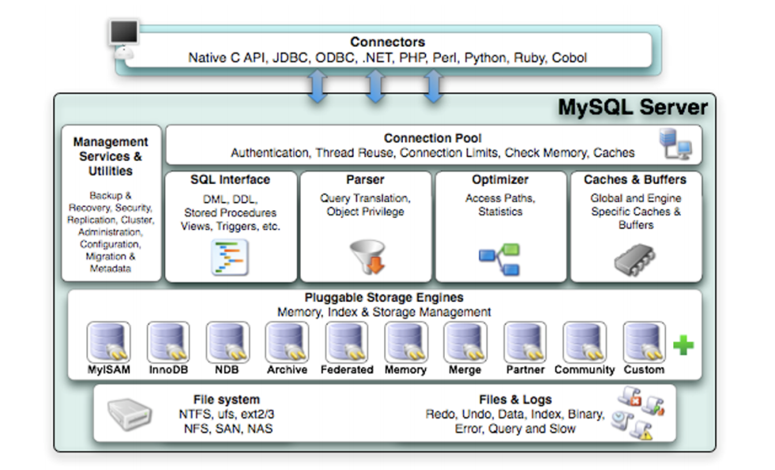

## 连接层

经过三次握手建立连接成功后， MySQL 服务器对 TCP 传输过来的账号密码做身份认证、权限获取。

- ==用户名或密码不对，会收到一个Access denied for user错误，客户端程序结束执行==
- ==用户名密码认证通过，会从权限表查出账号拥有的权限与连接关联，之后的权限判断逻辑，都将依赖于此时读到的权限==

TCP 连接收到请求后，必须要分配给一个线程专门与这个客户端的交互。所以还会有个线程池，去走后面的流程。每一个连接从线程池中获取线程，省去了创建和销毁线程的开销。

## 服务层

### SQL Interface: SQL接口

- 接收用户的SQL命令，并且返回用户需要查询的结果。比如SELECT ... FROM就是调用SQLInterface

- MySQL支持DML（数据操作语言）、DDL（数据定义语言）、存储过程、视图、触发器、自定义函数等多种SQL语言接口

### Parser: 解析器

- 在解析器中对 SQL 语句进行语法分析、语义分析。将SQL语句分解成数据结构，并将这个结构传递到后续步骤，以后SQL语句的传递和处理就是基于这个结构的。如果在分解构成中遇到错误，那么就说明这个SQL语句是不合理的。
- 在SQL命令传递到解析器的时候会被解析器验证和解析，并为其创建 语法树 ，并根据数据字典丰富查询语法树，会 验证该客户端是否具有执行该查询的权限 。创建好语法树后，MySQL还会对SQl查询进行语法上的优化，进行查询重写。

### Optimizer: 查询优化器

- SQL语句在语法解析之后、查询之前会使用查询优化器确定 SQL 语句的执行路径，生成一个执行计划 。

- 这个执行计划表明应该 使用哪些索引 进行查询（全表检索还是使用索引检索），表之间的连接顺序如何，最后会按照执行计划中的步骤调用存储引擎提供的方法来真正的执行查询，并将查询结果返回给用户。

- 它使用“ 选取-投影-连接 ”策略进行查询。例如：SELECT id,name FROM student WHERE gender = '女';

  这个SELECT查询先根据WHERE语句进行 选取 ，而不是将表全部查询出来以后再进行gender过滤。 这个SELECT查询先根据id和name进行属性 投影 ，而不是将属性全部取出以后再进行过滤，将这两个查询条件 连接 起来生成最终查询结果。

### Caches & Buffers： 查询缓存组件

- MySQL内部维持着一些Cache和Buffer，比如Query Cache用来缓存一条SELECT语句的执行结果，如果能够在其中找到对应的查询结果，那么就不必再进行查询解析、优化和执行的整个过程了，直接将结果反馈给客户端。
- 这个缓存机制是由一系列小缓存组成的。比如表缓存，记录缓存，key缓存，权限缓存等 。
- 这个查询缓存可以在 不同客户端之间共享 。
- 从MySQL 5.7.20开始，不推荐使用查询缓存，并在 MySQL 8.0中删除 。

## 引擎层

==插件式存储引擎层（ Storage Engines），真正的负责了MySQL中数据的存储和提取，对物理服务器级别维护的底层数据执行操作，服务器通过API与存储引擎进行通信。不同的存储引擎具有的功能不同，这样我们可以根据自己的实际需要进行选取==

## sql执行流程

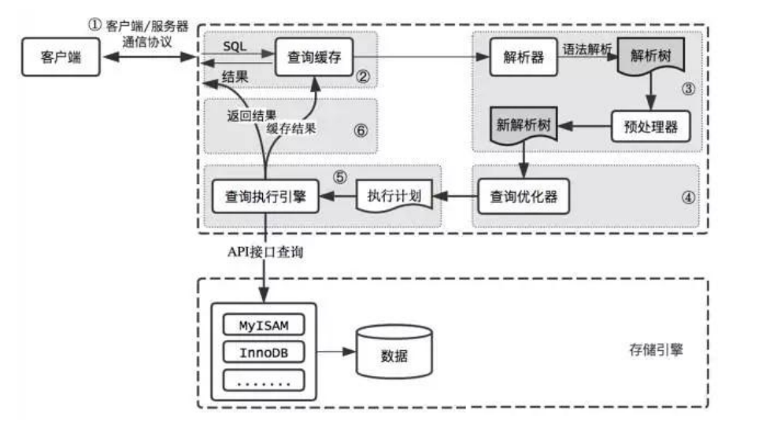

MySQL8.0+ 查询缓存被抛弃了？为什么 命中率低

- 查询缓存是提前把查询结果缓存起来，两个查询请求在任何字符上的不同（例如：空格、注释、大小写），都会导致缓存不会命中。因此 MySQL 的 查询缓存命中率不高 。
- 如果查询请求中包含某些系统函数、用户自定义变量和函数、一些系统表，如 mysql 表、NOW函数，如果在第一次查询时就缓存了，那第二次查询的时候直接使用第一次查询的结果就是错误的！
- 缓存失效的时候，如对该表使用了 INSERT 、 UPDATE 、 DELETE 、 TRUNCATE TABLE 、 ALTERTABLE 、 DROP TABLE 或 DROP DATABASE 语句，那使用该表的所有高速缓存查询都将变为无效并从高速缓存中删除！

## 使用profile查看执行计划

```sql
# 查看是否开启 session级别
select @@profiling
# 没有开启直接开启 session级别
set profiling=1
# 执行一条语句
mysql> select * from test.t1;
+------+------+
| id   | name |
+------+------+
|    1 | jack |
+------+------+
1 row in set (0.00 sec)

# 查看最近执行的语句
mysql> show profiles;
+----------+------------+---------------------------------+
| Query_ID | Duration   | Query                           |
+----------+------------+---------------------------------+
|       1 | 0.00032000 | select * from test.t1           |
+----------+------------+---------------------------------+
1 rows in set, 1 warning (0.00 sec)

# 查看执行过程，不指定query的话默认查询最新的一个记录
mysql> show profile;
# 或者根据query_id指定查询
mysql> show profile for query 1;
+--------------------------------+----------+
| Status                         | Duration |
+--------------------------------+----------+
| starting                       | 0.000066 |
| Executing hook on transaction  | 0.000004 |
| starting                       | 0.000007 |
| checking permissions           | 0.000007 |==校验权限==
| Opening tables                 | 0.000107 |==打开表==
| init                           | 0.000005 |==初始化==
| System lock                    | 0.000007 |==锁系统==
| optimizing                     | 0.000004 |==优化查询==
| statistics                     | 0.000012 |
| preparing                      | 0.000015 |==准备==
| executing                      | 0.000036 |==执行==
| end                            | 0.000003 |
| query end                      | 0.000003 |
| waiting for handler commit     | 0.000009 |
| closing tables                 | 0.000006 |
| freeing items                  | 0.000017 |
| cleaning up                    | 0.000014 |
+--------------------------------+----------+
17 rows in set, 1 warning (0.00 sec)
# 可以查询更加丰富的信息,information_schema.PROFILING 
mysql> show profile cpu,block io for query 1;
```

## Buffer Pool 缓冲池

缓冲池包括了数据页、索引页、插入缓冲、锁信息、自适应 Hash 和数据字典信息等。

缓冲池管理器会尽量将经常使用的数据保存起来，在数据库进行页面读操作的时候，首先会判断该页面是否在缓冲池中，如果存在就直接读取，如果不存在，就会通过内存或磁盘将页面存放到缓冲池中再进行读取。

==查询缓存cache，就是将查询结果进行缓存，buffer是在读取数据和写入数据的时候会先将数据写入buffer避免直接和磁盘操作==

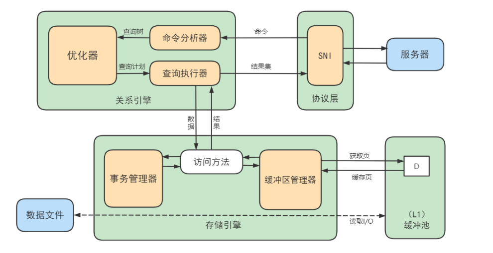

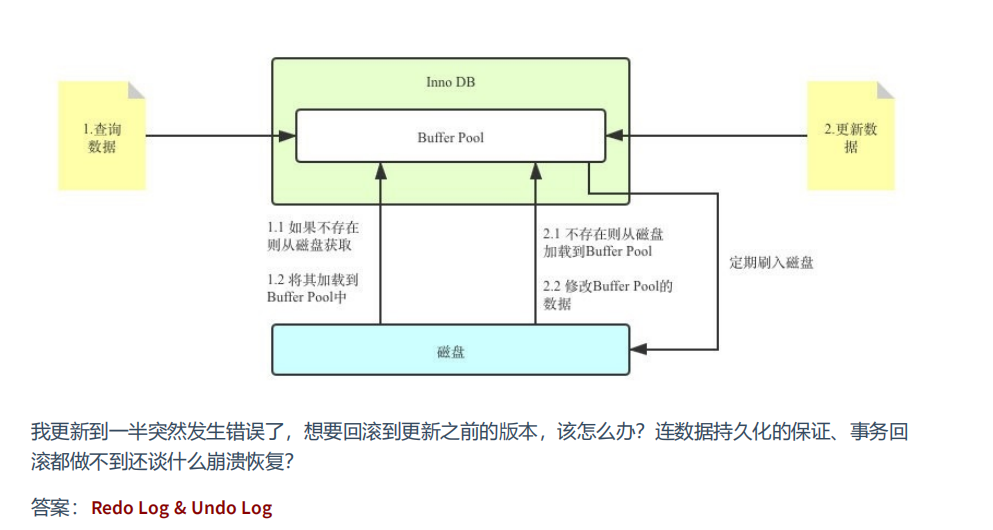

```sql
# 查看mysql的bufer大小134217728/1024/1024=128MB
mysql> show variables like 'innodb_buffer_pool_size';
+-------------------------+-----------+
| Variable_name           | Value     |
+-------------------------+-----------+
| innodb_buffer_pool_size | 134217728 |
+-------------------------+-----------+
1 row in set (0.00 sec)
# 查看mysql buffer有几个，假如有2个每个buffer=128/2
mysql> show variables like 'innodb_buffer_pool_instances';
+------------------------------+-------+
| Variable_name                | Value |
+------------------------------+-------+
| innodb_buffer_pool_instances | 2    |
+------------------------------+-------+
1 row in set (0.00 sec)


# 修改
set global innodb_buffer_pool_size = 268435456;
[server]
innodb_buffer_pool_size = 268435456
```

# 存储引擎

```sql
# 查看存储引擎
show engines;
# 查看系统默认存储引擎
show variables like '%storage_engine%';

# 修改默认存储引擎
SET DEFAULT_STORAGE_ENGINE=MyISAM;
vim my.cnf
default-storage-engine=MyISAM
```

## 引擎介绍

**InnoDB 引擎：具备外键支持功能的事务存储引擎**

- InnoDB是MySQL的 默认事务型引擎

- 数据文件结构：

  表名.ibd 存储数据和索引

- 对比MyISAM的存储引擎， InnoDB写的处理效率差一些 ，并且会占用更多的磁盘空间以保存数据和索引。

- MyISAM只缓存索引，不缓存真实数据；InnoDB不仅缓存索引还要缓存真实数据， 对内存要求较高 ，而且内存大小对性能有决定性的影响。

**MyISAM 引擎：主要的非事务处理存储引擎**

- MyISAM提供了大量的特性，包括全文索引、压缩、空间函数(GIS)等，但MyISAM 不支持事务、行级锁、外键 ，有一个毫无疑问的缺陷就是 崩溃后无法安全恢复 。
- 优势是访问的 速度快 ，对事务完整性没有要求或者以SELECT、INSERT为主的应用
- 针对数据统计有额外的常数存储。故而 count(*) 的查询效率很高
- 数据文件结构：
  - 表名.frm 存储表结构
  - 表名.MYD 存储数据 (MYData)
  - 表名.MYI 存储索引 (MYIndex)
- 应用场景：只读应用或者以读为主的业务

## innoDB和MyISAM区别(*)

| 特点         | **MyISAM**                                                   | InnoDB                                                       | MEMORY |
| ------------ | ------------------------------------------------------------ | ------------------------------------------------------------ | ------ |
| 存储限制     | 有                                                           | 64T                                                          | 有     |
| 事务安全     |                                                              | 支持                                                         |        |
| 锁机制       | 表锁，即使操作一行也锁定整个表                               | 行锁，只锁某一行，不对其他有影响，适合高并发                 | 表锁   |
| b树索引      | 支持（全部是非聚簇索引，索引叶子节点<br />直接存储的是data地址） | 支持（即有聚簇又有非聚簇，非聚簇存储的是主键的地址，从<br />主键也就是聚簇索引还要查寻数据的地址） | 支持   |
| hash索引     |                                                              |                                                              | 支持   |
| 全文索引     | 支持                                                         |                                                              |        |
| 集群索引     |                                                              | 支持                                                         |        |
| 数据缓存     |                                                              | 支持                                                         | 支持   |
| 索引缓存     | 只缓存索引，不缓存真实数据                                   | 不仅缓存索引还要缓存真实数据，对内存要求较高，<br />而且内存大小对性能有决定性的影响 | 支持   |
| 数据可压缩   | 支持                                                         |                                                              |        |
| 空间使用     | 低                                                           | 高                                                           | 不使用 |
| 内存使用     | 低                                                           | 高                                                           | 中等   |
| 批量插入速度 | 高                                                           | 低                                                           | 高     |
| 支持外键     |                                                              | 支持                                                         |        |

# 索引

​	聚簇索引 非聚簇索引(二级索引或者辅助索引) 回表 联合索引 为什么选择b+树 看idea里面的总结吧

# 索引优化(*)

## 索引插入顺序

为什么主键建议使用 AUTO_INCREMENT 属性，因为主键在插入的时候会进行排序，比如我们插入 1 5 10占满了一个页，这个时候如果2来了，需要插入 1 5之间，这时候就会产生页分裂，所以使用自增的主键不会产生也分裂，顺序写，空间小，性能高。

## 索引失效

- 最左匹配原则
- 计算、函数、类型转换(自动或手动)导致索引失效
- 类型转换导致索引失效
- 范围条件右边的列索引失效
- 不等于(!= 或者<>)索引失效
- is null可以使用索引，is not null无法使用索引
- like以通配符%开头索引失效
- OR 前后存在非索引的列，索引失效

## 查询优化

- 禁止使用内查询

​		① 执行子查询时，MySQL需要为内层查询语句的查询结果 建立一个临时表 ，然后外层查询语句从临时表中查询记录。查询完毕后，再 撤销这些临时表 。这样会消耗过多的CPU和IO资源，产生大量的慢查询。
​		② 子查询的结果集存储的临时表，不论是内存临时表还是磁盘临时表都 不会存在索引 ，所以查询性能会受到一定的影响。
​		③ 对于返回结果集比较大的子查询，其对查询性能的影响也就越大。

ORDER BY子句，尽量使用Index方式排序，避免使用FileSort方式排序。

SELECT * FROM student WHERE id > 2000000 LIMIT 10;

覆盖索引

就是查询的字段就是索引字段，不需要进行回表操作

字符串添加索引

前缀索引，比如 abcde 只创建碎银的前三个字节 abc

索引下推

索引下推看他的例子就是将索引条件直接在索引这里过滤，很奇怪难道本身不就应该这样吗？

普通索引vs唯一索引

普通索引 可能一个索引有多条rows，那我们查到第一条rows，然后一直往后查询，直到查询到一条不满足的，也是顺序查询影响不大，但是唯一索引直接查询就可以了。

其他查询优化

in 和 exists，都替换为join查询

```sql
select * from dept where exists( select * from employee where deptno=dept.deptno);
# 查询exists对外表采用遍历方式逐条查询，每次查询都会比较exists的条件语句，当exists里的条件语句返回记录行时则条件为真。此次返回当前遍历到的记录，反之，如果exists里的条件语句不能返回记录行，则丢弃当前遍历到的记录。

# 对外表做loop循环，每次loop循环再对内表（子查询）进行查询，那么因为对内表的查询使用的索引（内表效率高，故可用大表），而外表有多大都需要遍历，不可避免（尽量用小表），故内表大的使用exists，可加快效率；

elect * from tabA where tabA.x in (select x from tabB where y>0 );
# 执行tabB表的子查询，得到结果集B，可以使用到tabB表的索引y；
# 执行tabA表的查询，查询条件是tabA.x在结果集B里面，可以使用到tabA表 的索引x。

# 是把外表和内表做连接，先查询内表，再把内表结果与外表匹配，对外表使用索引（外表效率高，可用大表），而内表多大都需要查询，不可避免，故外表大的使用in，可加快效率。

# 我自己 exists就是遍历外表，拿着外表去查询内表，所以exists适合外表小（拿着外表的值去检索内表的索引），内表大
# in就是查询出内表，然后拿着内表的值去检索外表的数据所以适合 外表大内标小 


内表大外表小的适合使用exists。
内表小外表大适合用in

```

select(*) select(字段) select(1)

1. count(primary key)。遍历整个表，把[主键值](https://www.zhihu.com/search?q=主键值&search_source=Entity&hybrid_search_source=Entity&hybrid_search_extra={"sourceType"%3A"answer"%2C"sourceId"%3A767552025})拿出来，累加；
2. count(1)。遍历整个表，但是不取值，[累加](https://www.zhihu.com/search?q=累加&search_source=Entity&hybrid_search_source=Entity&hybrid_search_extra={"sourceType"%3A"answer"%2C"sourceId"%3A767552025})；
3. count(非空字段)。遍历整个表，读出这个字段，累加；
4. count(可以为空的字段)。遍历整个表，读出这个字段，判断不为null累加；
5. count(*)。遍历整个表，做了优化，不取值，累加。

count(*) ≈ count(常量) > count(id) > count(非空字段)>count(可以为空的字段)

淘宝主键设计

==自增id的缺陷==

**1.** **可靠性不高**

存在自增ID回溯的问题，这个问题直到最新版本的MySQL 8.0才修复。

**2.** **安全性不高**

对外暴露的接口可以非常容易猜测对应的信息。比如：/User/1/这样的接口，可以非常容易猜测用户ID的

值为多少，总用户数量有多少，也可以非常容易地通过接口进行数据的爬取。

**3.** **性能差**

自增ID的性能较差，需要在数据库服务器端生成。

**4.** **交互多**

业务还需要额外执行一次类似 last_insert_id() 的函数才能知道刚才插入的自增值，这需要多一次的

网络交互。在海量并发的系统中，多1条SQL，就多一次性能上的开销。

**5.** **局部唯一性**

最重要的一点，自增ID是局部唯一，只在当前数据库实例中唯一，而不是全局唯一，在任意服务器间都

是唯一的。对于目前分布式系统来说，这简直就是噩梦。

==建议尽量不要用跟业务有关的字段做主键。毕竟，作为项目设计的技术人员，我们谁也无法预测在项目的整个生命周期中，哪个业务字段会因为项目的业务需求而有重复，或者重用之类的情况出现==

​	可以使用uuid比如mysql自己的uuid

​	uuid 时间戳(按照低位在高位)+时钟+机器码

​	mysql自己的uuid(mysql的低位就是低位 高位就是高位) +时钟+机器码


# 性能分析工具

## 慢日志

### 慢日志参数

```sql
mysql> select @@slow_query_log;

# 查看慢查询
mysql> show variables like '%slow_query_log%';
+---------------------+----------------------------------------+
| Variable_name       | Value                                  |
+---------------------+----------------------------------------+
| slow_query_log      | OFF                                    |
| slow_query_log_file | /var/lib/mysql/VM-24-4-centos-slow.log |
+---------------------+----------------------------------------+
2 rows in set (0.00 sec)

# 10秒钟就算慢查询
mysql> show variables like '%long_query_time%';
+-----------------+-----------+
| Variable_name   | Value     |
+-----------------+-----------+
| long_query_time | 10.000000 |
+-----------------+-----------+
1 row in set (0.00 sec)

# 慢查询有多少条
mysql> SHOW GLOBAL STATUS LIKE '%Slow_queries%';
+---------------+-------+
| Variable_name | Value |
+---------------+-------+
| Slow_queries  | 0     |
+---------------+-------+
1 row in set (0.00 sec)
```

### 慢日志分析工具

```sql
# 执行了下报错了 先不管了
mysqldumpslow -s t -t 5 /var/lib/mysql/atguigu01-slow.log
```

## 执行成本

```bash
# 开启后可以查看执行了那些sql及其执行成本
show variables like 'profiling';
# 查看所有执行的sql
show profiles;
# 查看最新一条执行的sql
show profile;
# 查看queryid=2 执行的sql 一些cup io信息
show profile cpu,block io for query 2;

# ① ALL：显示所有的开销信息。 
# ② BLOCK IO：显示块IO开销。 
# ③ CONTEXT SWITCHES：上下文切换开销。 
# ④ CPU：显示CPU开销信息。 ⑤ IPC：显示发送和接收开销信息。 ⑥ MEMORY：显示内存开销信息。 
# ⑦ PAGE FAULTS：显示页面错误开销信息。 ⑧ SOURCE：显示和Source_function，Source_file，Source_line相关的开销信息。 
# ⑨ SWAPS：显示交换次数开销信息。
```

## 执行计划

看了和没看没啥区别；

```sql
# 查看执行计划 explain or describe
EXPLAIN SELECT select_options
DESCRIBE SELECT select_options
```

| 列名          | 描述                                                         |
| ------------- | ------------------------------------------------------------ |
| id            | 在一个大的查询语句中每个SELECT关键字都对应一个 唯一的id<br />==**id如果相同，可以认为是一组，从上往下顺序执行**；**在所有组中，id值越大，优先级越高，越先执行**；<br />==**==id号每个号码，表示一趟独立的查询，一个sql的查询趟数越少越好==** |
| select_type   | SELECT关键字对应的那个查询的类型                             |
| table         | 表名                                                         |
| partitions    | 匹配的分区信息                                               |
| type          | 针对单表的访问方法，==结果值从最好到最坏依次是： system > const > eq_ref > ref > fulltext > ref_or_null > index_merge > unique_subquery > index_subquery > range > index > ALL 其中比较重要的几个提取出来（见上图中的蓝色）。SQL 性能优化的目标：至少要达到 range 级别，要求是 ref 级别，最好是 consts级别。（阿里巴巴开发手册要求）== |
| possible_keys | 可能用到的索引                                               |
| key           | 实际上使用的索引                                             |
| key_len       | 实际使用到的索引长度                                         |
| ref           | 当使用索引列等值查询时，与索引列进行等值匹配的对象信息       |
| rows          | 预估的需要读取的记录条数                                     |
| filtered      | 某个表经过搜索条件过滤后剩余记录条数的百分比                 |
| Extra         | 一些额外的信息                                               |

## 分析视图监控

- 主机相关：以host_summary开头，主要汇总了IO延迟的信息。
- Innodb相关：以innodb开头，汇总了innodb buffer信息和事务等待innodb锁的信息。
- I/o相关：以io开头，汇总了等待I/O、I/O使用量情况。
- 内存使用情况：以memory开头，从主机、线程、事件等角度展示内存的使用情况
- 连接与会话信息：processlist和session相关视图，总结了会话相关信息。
- 表相关：以schema_table开头的视图，展示了表的统计信息。
- 索引信息：统计了索引的使用情况，包含冗余索引和未使用的索引情况。
- 语句相关：以statement开头，包含执行全表扫描、使用临时表、排序等的语句信息。
- 用户相关：以user开头的视图，统计了用户使用的文件I/O、执行语句统计信息。
- 等待事件相关信息：以wait开头，展示等待事件的延迟情况

```sql
索引情况
#1. 查询冗余索引
select * from sys.schema_redundant_indexes;
#2. 查询未使用过的索引
select * from sys.schema_unused_indexes;
#3. 查询索引的使用情况
select index_name,rows_selected,rows_inserted,rows_updated,rows_deleted
from sys.schema_index_statistics where table_schema='dbname' ;

表相关
# 1. 查询表的访问量
select table_schema,table_name,sum(io_read_requests+io_write_requests) as io from
sys.schema_table_statistics group by table_schema,table_name order by io desc;
# 2. 查询占用bufferpool较多的表
select object_schema,object_name,allocated,data
from sys.innodb_buffer_stats_by_table order by allocated limit 10;
# 3. 查看表的全表扫描情况
select * from sys.statements_with_full_table_scans where db='dbname';

语句相关
#1. 监控SQL执行的频率
select db,exec_count,query from sys.statement_analysis
order by exec_count desc;
#2. 监控使用了排序的SQL
select db,exec_count,first_seen,last_seen,query
from sys.statements_with_sorting limit 1;
#3. 监控使用了临时表或者磁盘临时表的SQL
select db,exec_count,tmp_tables,tmp_disk_tables,query
from sys.statement_analysis where tmp_tables>0 or tmp_disk_tables >0
order by (tmp_tables+tmp_disk_tables)

IO相关
#1. 查看消耗磁盘IO的文件
select file,avg_read,avg_write,avg_read+avg_write as avg_io
from sys.io_global_by_file_by_bytes order by avg_read limit 10;

Innodb 相关
#1. 行锁阻塞情况
select * from sys.innodb_lock_waits;
```

# 事务日志(*)

事务的特性：原子性 一致性 隔离性 持久性

REDO LOG： 重做日志，提供再写入操作，恢复提交事务修改的页操作，用来保证事务的持久性。

UNDO LOG：回滚日志，回滚行记录到某个特定版本，用来保证事务的原子性、一致性。

## 为什么需要redo log

==redo log 不就是预写日志吗 wal，称呼不同而已==

一方面，缓冲池可以帮助我们消除CPU和磁盘之间的鸿沟，checkpoint机制可以保证数据的最终落盘，然而由于checkpoint 并不是每次变更的时候就触发 的，而是master线程隔一段时间去处理的。所以最坏的情况就是事务提交后，刚写完缓冲池，数据库宕机了，那么这段数据就是丢失的，无法恢复。

另一方面，事务包含 持久性 的特性，就是说对于一个已经提交的事务，在事务提交后即使系统发生了崩溃，这个事务对数据库中所做的更改也不能丢失。

那么如何保证这个持久性呢？ 一个简单的做法 ：在事务提交完成之前把该事务所修改的所有页面都刷新到磁盘，但是这个简单粗暴的做法有些问题

另一个解决的思路 ：我们只是想让已经提交了的事务对数据库中数据所做的修改永久生效，即使后来系统崩溃，在重启后也能把这种修改恢复出来。所以我们其实没有必要在每次事务提交时就把该事务在内存中修改过的全部页面刷新到磁盘，只需要把 修改 了哪些东西 记录一下 就好。比如，某个事务将系统表空间中 第10号 页面中偏移量为 100 处的那个字节的值 1 改成 2 。我们只需要记录一下：将第0号表空间的10号页面的偏移量为100处的值更新为 2 。

## redo log 刷盘策略

redo log的写入并不是直接写入磁盘的，InnoDB引擎会在写redo log的时候先写redo log buffer，之后以 一定的频率 刷入到真正的redo log file 中。这里的一定频率怎么看待呢？这就是我们要说的刷盘策略。

==注意，redo log buffer刷盘到redo log file的过程并不是真正的刷到磁盘中去，只是刷入到 文件系统缓存（page cache）中去（这是现代操作系统为了提高文件写入效率做的一个优化），真正的写入会交给系统自己来决定（比如page cache足够大了）。那么对于InnoDB来说就存在一个问题，如果交给系统来同步，同样如果系统宕机，那么数据也丢失了（虽然整个系统宕机的概率还是比较小的）。针对这种情况，InnoDB给出 innodb_flush_log_at_trx_commit 参数，该参数控制 commit提交事务时，如何将 redo log buffer 中的日志刷新到 redo log file 中。它支持三种策略：==

设置为0 ：表示每次事务提交时不进行刷盘操作。（系统默认master thread每隔1s进行一次重做日志的同步）
设置为1 ：表示每次事务提交时都将进行同步，刷盘操作（ 默认值 ）
设置为2 ：表示每次事务提交时都只把 redo log buffer 内容写入 page cache，不进行同步。由os自己决定什么时候同步到磁盘文件。

## redo log 参数

- innodb_log_group_home_dir ：指定 redo log 文件组所在的路径，默认值为 ./ ，表示在数据库的数据目录下。MySQL的默认数据目录（ var/lib/mysql ）下默认有两个名为 ib_logfile0 和ib_logfile1 的文件，log buffer中的日志默认情况下就是刷新到这两个磁盘文件中。此redo日志文件位置还可以修改。
- innodb_log_files_in_group：指明redo log file的个数，命名方式如：ib_logfile0，iblogfile1...iblogfilen。默认2个，最大100个。
- innodb_flush_log_at_trx_commit：控制 redo log 刷新到磁盘的策略，默认为1。
- innodb_log_file_size：单个 redo log 文件设置大小，默认值为 48M 。最大值为512G，注意最大值指的是整个 redo log 系列文件之和，即（innodb_log_files_in_group * innodb_log_file_size ）不能大于最大值512G。
- 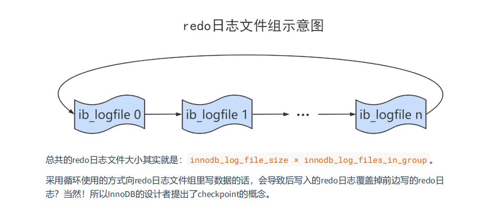

然后mysql提出了一个checkpoint的概念，这里的checkpoint真的就是检查指针的意思，和环形缓冲区的概念差不多。

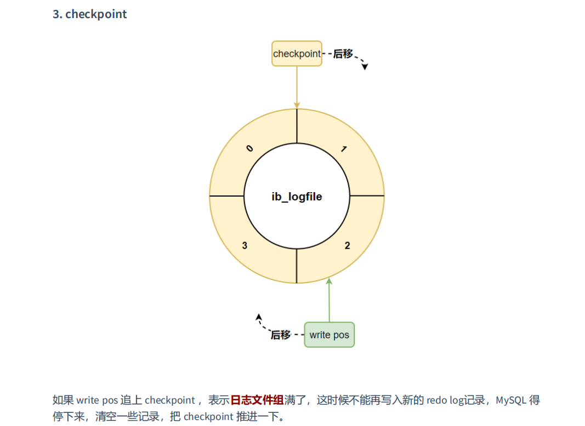

## undo log

事务需要保证 原子性 ，也就是事务中的操作要么全部完成，要么什么也不做。但有时候事务执行到一半会出现一些情况，比如：

- 情况一：事务执行过程中可能遇到各种错误，比如 服务器本身的错误 ， 操作系统错误 ，甚至是突然 断电 导致的错误。
- 情况二：程序员可以在事务执行过程中手动输入 ROLLBACK 语句结束当前事务的执行。

以上情况出现，我们需要把数据改回原先的样子，这个过程称之为 回滚 ，这样就可以造成一个假象：这个事务看起来什么都没做，所以符合 原子性 要求。

InnoDB对undo log的管理采用段的方式，也就是 回滚段（rollback segment），每个rollback segment包含1024个事务，查看有多少回滚段

```sql
mysql> show variables like 'innodb_undo_logs';
128
```

## redo undo binlog 写入简要流程

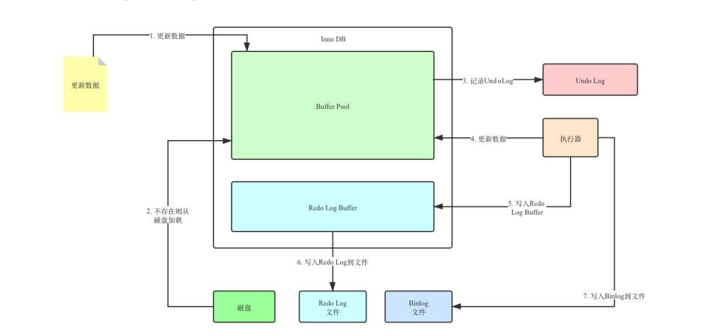

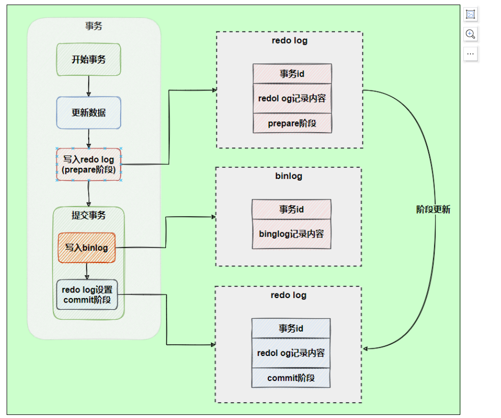

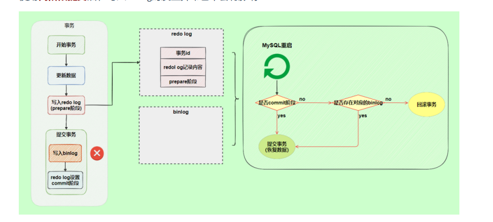

# 锁(*) 感觉锁这里不看视频真的很难理解 暂时搁浅

行锁 页锁 表锁，晦涩难懂简单理解概念好了具体原理算了吧。

脏读：读到了未提交事务的数据。

不可重复读： 事务 A 先读取一条数据，然后执行逻辑的过程中，事务 B 更新了这条数据，事务 A 再读取时，发现数据不匹配，这个现象就是“不可重复读”。

脏读 指读取到其他事务正在处理的未提交数据

不可重复读 指并发更新时，另一个事务前后查询相同数据时的数据不符合预期

幻读 指并发新增、删除这种会产生数量变化的操作时，另一个事务前后查询相同数据时的不符合预期

SHOW VARIABLES LIKE 'transaction_isolation';

看这个吧讲的非常好：

https://www.bilibili.com/video/BV1hL411479T/?spm_id_from=pageDriver&vd_source=9c1ee8129de3905737645f249b5cd29d

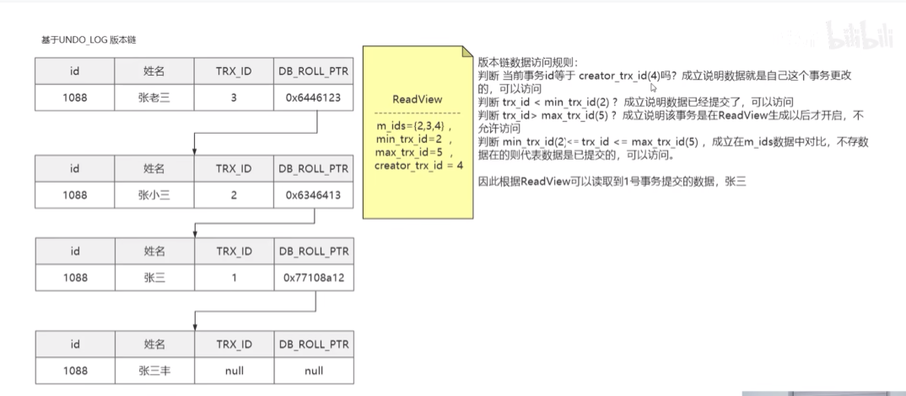

# 并发控制(*)

## mvcc

MVCC （Multiversion Concurrency Control），多版本并发控制。顾名思义，MVCC 是通过数据行的多个版本管理来实现数据库的 并发控制 。

1. **快照读**

   快照读又叫一致性读，读取的是快照数据。**不加锁的简单的** **SELECT** **都属于快照读**，即不加锁的非阻塞读；比如这样：SELECT * FROM player WHERE 

   之所以出现快照读的情况，是基于提高并发性能的考虑，快照读的实现是基于MVCC，它在很多情况下，避免了加锁操作，降低了开销。既然是基于多版本，那么快照读可能读到的并不一定是数据的最新版本，而有可能是之前的历史版本。快照读的前提是隔离级别不是串行级别，串行级别下的快照读会退化成当前读。

2. **当前都**

   当前读读取的是记录的最新版本（最新数据，而不是历史版本的数据），读取时还要保证其他并发事务不能修改当前记录，会对读取的记录进行加锁。加锁的 SELECT，或者对数据进行增删改都会进行当前读。比如：

```sql
SELECT * FROM student LOCK IN SHARE MODE; # 共享锁
SELECT * FROM student FOR UPDATE; # 排他锁
INSERT INTO student values ... # 排他锁
DELETE FROM student WHERE ... # 排他锁
UPDATE student SET ... # 排他锁
```

# 其他日志(*)

日志不能直接查看的都可以通过mysqlbinlog

- **慢查询日志**

  记录所有执行时间超过long_query_time的所有查询，方便我们对查询进行优化。

- **通用查询日志**

  记录所有连接的起始时间和终止时间，以及连接发送给数据库服务器的所有指令，对我们复原操作的实际场景、发现问题，甚至是对数据库操作的审计都有很大的帮助。

- **错误日志**

  记录MySQL服务的启动、运行或停止MySQL服务时出现的问题，方便我们了解服务器的状态，从而对服务器进行维护。

- **二进制日志**

  记录所有更改数据的语句，可以用于主从服务器之间的数据同步，以及服务器遇到故障时数据的无损失恢复。

- **中继日志**

  用于主从服务器架构中，从服务器用来存放主服务器二进制日志内容的一个中间文件。从服务器通过读取中继日志的内容，来同步主服务器上的操作。

- **数据定义语句日志**

  记录数据定义语句执行的元数据操作。

```sql
# 通用日志 默认关闭 VM-24-4-centos.log VM-24-4-centos是我的主机名称mysql默认这样起名字
mysql> SHOW VARIABLES LIKE '%general%';
+------------------+-----------------------------------+
| Variable_name    | Value                             |
+------------------+-----------------------------------+
| general_log      | OFF                               |
| general_log_file | /var/lib/mysql/VM-24-4-centos.log |
+------------------+-----------------------------------+

# 错误日志默认开启 并无法被禁止
[mysqld]
log-error=[path/[filename]] #path为日志文件所在的目录路径，filename为日志文件名

mysql> SHOW VARIABLES LIKE 'log_err%';
+----------------------------+----------------------------------------+
| Variable_name              | Value                                  |
+----------------------------+----------------------------------------+
| log_error                  | /var/log/mysqld.log                    |
| log_error_services         | log_filter_internal; log_sink_internal |
| log_error_suppression_list |                                        |
| log_error_verbosity        | 2                                      |
+----------------------------+----------------------------------------+
4 rows in set (0.00 sec)

# logbin日志
mysql> show variables like '%log_bin%';
+---------------------------------+-----------------------------+
| Variable_name                   | Value                       |
+---------------------------------+-----------------------------+
| log_bin                         | ON                          |
| log_bin_basename                | /var/lib/mysql/binlog       |
| log_bin_index                   | /var/lib/mysql/binlog.index |
| log_bin_trust_function_creators | OFF                         |
| log_bin_use_v1_row_events       | OFF                         |
| sql_log_bin                     | ON                          |
+---------------------------------+-----------------------------+

# 查看logbin日志的文件和大小
mysql> SHOW BINARY LOGS;
mysql> show variables like 'binlog_format';
	row statement mixed: row 会将这行数据进行记录 statement 会记录操作的语句 mixed 混合的
mysql> show variables like 'max_binlog_size';
mysql> show variables like 'binlog_expire_logs_seconds';
```

# 主从复制

## 主从复制原理

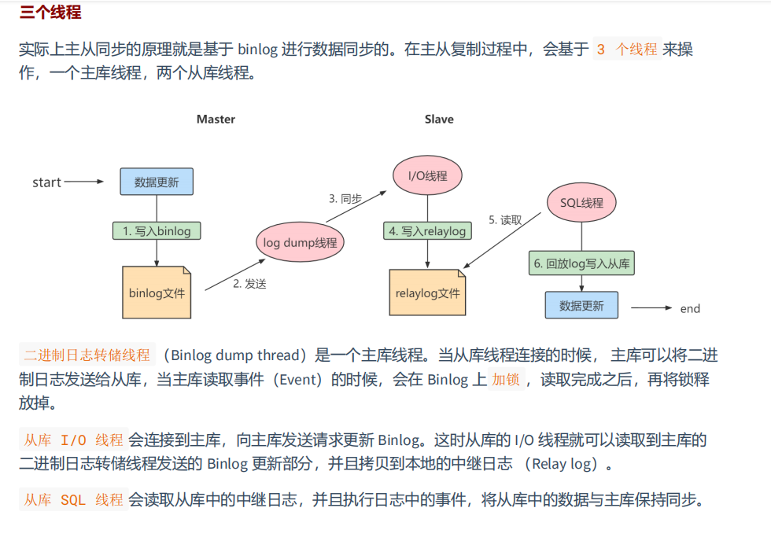

```bash
# master 配置 除了server-id 以外什么也不要配置 logbin是默认开启的，尤其是binlog-ignore-db更不要配置
#[必须]主服务器唯一ID
server-id=1
#[必须]启用二进制日志,指名路径。比如：自己本地的路径/log/mysqlbin
log-bin=atguigu-bin	
#[可选] 0（默认）表示读写（主机），1表示只读（从机）
read-only=0
#设置日志文件保留的时长，单位是秒
binlog_expire_logs_seconds=6000
#控制单个二进制日志大小。此参数的最大和默认值是1GB
max_binlog_size=200M
#[可选]设置不要复制的数据库
binlog-ignore-db=test
#[可选]设置需要复制的数据库,默认全部记录。比如：binlog-do-db=atguigu_master_slave
binlog-do-db=需要复制的主数据库名字
#[可选]设置binlog格式
binlog_format=STATEMENT


# slave配置 直接配置一个server-id好了 我之前看的mysql书slave这里的配置还是有点的，
#[必须]从服务器唯一ID
server-id=2
#[可选]启用中继日志
relay-log=mysql-relay


#在主机MySQL里执行授权主从复制的命令
GRANT REPLICATION SLAVE ON *.* TO 'slave1'@'从机器数据库IP' IDENTIFIED BY 'abc123';

# 如果使用的是MySQL8，需要如下的方式建立账户，并授权slave：
CREATE USER 'slave1'@'%' IDENTIFIED BY '123456';
GRANT REPLICATION SLAVE ON *.* TO 'slave1'@'%';
#此语句必须执行。否则见下面。
ALTER USER 'slave1'@'%' IDENTIFIED WITH mysql_native_password BY '123456';
flush privileges;

# 开启slave
mysql>CHANGE MASTER TO
MASTER_HOST='192.168.1.150',MASTER_USER='slave1',MASTER_PASSWORD='123456',MASTER_LOG_F
ILE='atguigu-bin.000007',MASTER_LOG_POS=154;
mysql>START SLAVE;
mysql>SHOW SLAVE STATUS;
```

# 主从备份

- **物理备份**

  备份数据文件，转储数据库物理文件到某一目录。物理备份恢复速度比较快，但占用空间比较大，MySQL中可以用 xtrabackup 工具来进行物理备份。

- **逻辑备份**

  对数据库对象利用工具进行导出工作，汇总入备份文件内。逻辑备份恢复速度慢，但占用空间小，更灵活。MySQL 中常用的逻辑备份工具为 mysqldump 。逻辑备份就是 备份sql语句 ，在恢复的时候执行备份的sql语句实现数据库数据的重现。

```sql
# mysqldump –u 用户名称 –h 主机名称 –p密码 待备份的数据库名称[tbname, [tbname...]]> 备份文件名称.sql
# 备份文件存储在当前目录下
mysqldump -uroot -p atguigu book> book.sql 
# 备份全部数据库
mysqldump -uroot -pxxxxxx --all-databases > all_database.sql
mysqldump -uroot -pxxxxxx -A > all_database.sql

# 恢复
mysql –u root –p [dbname] < backup.sql
```

