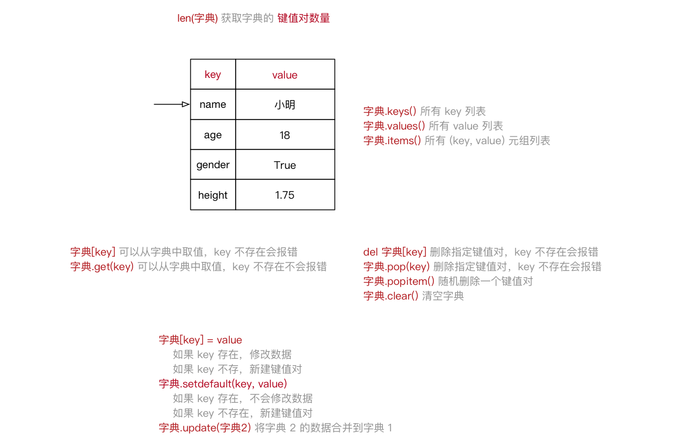

**note：这个文档很久之前写的，可以参考下，建议还是看官网**

# 简介

​	Python 是一种解释型、面向对象、动态数据类型的高级程序设计语言，**官方宣布，2020 年 1 月 1 日， 停止 Python 2 的更新。Python 2.7 被确定为最后一个 Python 2.x 版本。**

# 入门

## 安装

### window10

​	window安装直接去官网下载安装包即可，然后设置path环境变量D:\soft\python-3.10.2

## 运行python

- 交互式 直接window+r，输入python，在终端输入命令即可。
- 命令行脚本 编写好python文件，终端执行，python hellworld.py
- 集成开发环境，pycharm不错和idea一样，什么也不用配置，直接安装使用即可。

## python的中文编码

​	python2可能会有中文编码的问题，我本机安装的python3没问题，Python中默认的编码格式是 ASCII 格式，在没修改编码格式时无法正确打印汉字，所以在读取中文时会报错。可以在程序的头部注释

 **# -\*- coding: UTF-8 -\*-** 或者 **# coding=utf-8** 

```python
#!/usr/bin/python
# -*- coding: UTF-8 -*-
# !/usr/bin/python3
print( "你好，世界" )
```

## 注释

```python
python 中"" 和 '' 是一样的
# 单行注释一般写在代码的上面，#与文字中间要有一个空格，遇见英文时英文俩测要各有一个空格
'''
这是一个多行注释
'''
print("hell world")  # 在代码后面添加注释 代码与注释要有俩个空格 然后再编写注释，一般不建议再代码后面添加注释
```

## __main__

Python属于脚本语言，不像编译型语言那样先将程序编译成二进制再运行，而是动态的逐行解释运行。也就是从脚本第一行开始运行，没有统一的入口。

一个 Python 源码文件除了可以被直接运行外，还可以作为模块（也就是库）被导入。不管是导入还是直接运行，最顶层的代码都会被运行（Python 用缩进来区分代码层次）。而实际上在导入的时候，有一部分代码我们是不希望被运行的。

`if __name__ == '__main__'` 就相当于是 Python **模拟的程序入口**。Python 本身并没有规定这么写，这只是一种编码习惯。由于模块之间相互引用，不同模块可能都有这样的定义，而入口程序只能有一个。到底哪个入口程序被选中，这取决于 `__name__` 的值。

一般`__new__`用来创建对象  `__init__`用来初始化


`__init__.py` 文件的作用是将文件夹变为一个Python模块,Python 中的每个模块的包中，都有`__init__.py` 文件。

通常`__init__.py` 文件为空，但是我们还可以为它增加其他的功能。我们在导入一个包时，实际上是执行它的__init__.py文件。这样我们可以在__init__.py文件中批量导入我们所需要的模块，而不再需要一个一个的导入,比如里面定义了`__all__ = ["echo", "surround", "reverse"]`,这将意味着将 `from sound.effects import *` 导入 `sound.effects` 包的三个命名的子模块。(https://docs.python.org/zh-cn/3/tutorial/modules.html#tut-packages)

python在加载一个插件的时候会将插件中模块的`__init__.py`执行。

```python
PI = 3.14

def main():
    print("PI:", PI) 

if __name__ == "__main__":
    main()
    
# _ __X __X__ https://docs.python.org/zh-cn/3/tutorial/classes.html#private-variables
# _ 私有变量
# __X 为了避免在继承中命名冲突而起的变量名，将被改写为 _{类名}__{变量名}，其实就是为了防止父类和子类定义相同字段冲突而已没别的作用
# __x__：是Python内建的属性方法，最好不要在外部调用，也称为魔术方法。
class A:
    def __init__(self, name):
        self.__name = "a_name"


class B:
    def __init__(self, name):
        self.__name = "b_name"


class C(A, B):
    def __init__(self, name, age=18):
        A.__init__(self, name)
        B.__init__(self, name)
        self.__name = name
        self.age = age


c = C("c_name")
print(c.__dict__)  # {'_A__name': 'a_name', '_B__name': 'b_name', '_C__name': 'c_name'}
print(c.age)
```

## 将代码写为一行

```python
a = 1; b = 2; c = 3;
```

### 三目运算

```python
b = 'b1' if x == 10 else 'b2'
```

### 列表推导式

```python
"""
1.1 创建空列表
1.2 循环将有规律的数据写入到列表
"""
# for 实现--------------
# list1 = []
# for i in range(10):
#     list1.append(i)
#
# print(list1)

# 列表推导式实现------------------------
list1 = [i for i in range(10)]
print(list1)

-------------------------------------------------
a = [eval('3 * x') for i in range(500)]

-------------------------------------------------
# 二 需求：0-10偶数数据的列表
# 1. 简单列表推导式 range步长
list1 = [i for i in range(0, 10, 2)]
print(list1)

# 2. for循环加if 创建有规律的列表
list2 = []
for i in range(10):
    if i % 2 == 0:
        list2.append(i)

print(list2)

# 3. 把for循环配合if的代码 改写 带if的列表推导式
list3 = [i for i in range(10) if i % 2 == 0]
print(list3)

-------------------------------------------------
# 三 多个列表推导式
# [(1, 0), (1, 1), (1, 2), (2, 0), (2, 1), (2, 2)]
# 数据1 ： 1 和 2  range(1,3)
# 数据2 ：0 1 2  range(3)
list1 = []
for i in range(1, 3):
    for j in range(3):
        # 列表里面追加元组： 循环前准备一个空列表，然后这里追加元组数据到列表
        list1.append((i, j))

print(list1)

# 多个for实现列表推导式
list2 = [(i, j) for i in range(1, 3) for j in range(3)]
print(list2)

-------------------------------------------------
# 创建字典 key是1-5的数字，v是这个数字的平方
# dict1 = {k: v for i in range(1, 5)}
dict1 = {i: i**2 for i in range(1, 5)}
print(dict1)
```

## 创建虚拟环境

```python
# 安装虚拟环境
python3 -m venv ./env
# 升级pip
python3 -m pip install --upgrade pip
# 安装jupyter
pip3 install jupyter
# 打开jupyter 默认端口8888 打开多个依次增加8889,在那个路径打开就会默认显示那个路径的文件
cd xxx
jupyter notebook

--- 更加详细的文档
# 1 准备虚拟环境
# 安装虚拟环境
python3 -m venv myenv
# 激活 window：
.\myenv\Scripts\Activate
# 激活 macOS 和 Linux 
source myenv/bin/activate
# 升级pip
./myenv/bin/python3 -m pip install -U pip
# 激活后终端提示符发生了变化，显示虚拟环境的名称，表示你现在在虚拟环境中工作。
# 安装和运行,不用./myenv/bin/python3这个路径，默认就是使用的当前python
pip install package_name
python your_script.py
# 退出虚拟环境
deactivate

# 2 安装jupyterlab
pip install jupyterlab
# 默认port 8888，可以一直启动，端口会自动+1，也可以指定端口
jupyter lab
```

# 数据类型

## 变量-格式化输出

```python
# python 中 "" 与 '' 相同
# 变量的定义
name = 'tom'
age = 18
price = 1.0

# 格式化输出 f 比 % 更快捷好用
print(f'name: {name}')  # name: tom
# 格式化占位符 %s: 字符串 %d int %f float
print('name: %s age: %d price %f'  % (name, age, price))  # name: tom age: 18 price 1.000000

# 小驼峰 myFirstName
# 大驼峰 MyFirstName
# 下划线 my_first_name

# 输入变量
name = input('my name is...')
print(name)

# 使用*
print('-' * 50)

# 在 `Python` 中，要使用随机数，首先需要导入 **随机数** 的 **模块** —— “工具包”
import random
print(random.randint(10, 20))  # 生成的随机数n: 10 <= n <= 20 

password = input('请输⼊您的密码：')
```

| 格式化字符 | 含义                                                         |
| ---------- | ------------------------------------------------------------ |
| %s         | 字符串                                                       |
| %d         | 有符号十进制整数，`%06d` 表示输出的整数显示位数，不足的地方使用 `0` 补全超出当前位数则原样输出 |
| %f         | 浮点数，`%.2f` 表示小数点后只显示两位                        |
| %%         | 输出 `%`                                                     |

## 数据类型


```python
# 查看数据所属类型
print(type('tom')) 
# 数据类型转化
age = '100'
price = 88.9
print(type(age))  # <class 'str'>
print(type(int(age)))  # <class 'int'>
print(type(price))  # <class 'float'>
print(f'{int(price)} : {type(int(price))}')  # 88 : <class 'int'>

# eval 还原数据类型
print(type(eval(age)))  # <class 'int'>
```

## 数据转换

| 函数            | 说明                                                |
| --------------- | --------------------------------------------------- |
| int(x [,base ]) | 将对象 x 转换为整数                                 |
| float(x )       | 将对象 x 转换为浮点数                               |
| str(x )         | 将对象 x 转换为字符串                               |
| eval(str )      | ⽤来计算在字符串中的有效Python表达式,并返回⼀个对象 |
| tuple(s )       | 将序列 s 转换为⼀个元组                             |
| list(s )        | 将序列 s 转换为⼀个列表                             |


## 运算符

### 算数运算符

| 运算符 |  描述  | 实例                                       |
| :----: | :----: | ------------------------------------------ |
|   +    |   加   | 10 + 20 = 30                               |
|   -    |   减   | 10 - 20 = -10                              |
|   *    |   乘   | 10 * 20 = 200                              |
|   /    |   除   | 10 / 20 = 0.5                              |
|   //   | 取整除 | 返回除法的整数部分（商） 9 // 2 输出结果 4 |
|   %    | 取余数 | 返回除法的余数 9 % 2 = 1                   |
|   **   |   幂   | 又称次方、乘方，2 ** 3 = 8                 |

### 逻辑运算符

| 运算符 | 逻辑表达式 | 描述                                                         |
| ------ | ---------- | ------------------------------------------------------------ |
| and    | x and y    | 只有 x 和 y 的值都为 True，才会返回 True<br />否则只要 x 或者 y 有一个值为 False，就返回 False |
| or     | x or y     | 只要 x 或者 y 有一个值为 True，就返回 True<br />只有 x 和 y 的值都为 False，才会返回 False |
| not    | not x      | 如果 x 为 True，返回 False<br />如果 x 为 False，返回 True   |

### 成员运算符

| 运算符 | 逻辑表达式            | 描述                                                    |
| ------ | --------------------- | ------------------------------------------------------- |
| in     | if ( a in list ):     | 如果在指定的序列中找到值返回 True，否则返回 False。     |
| not in | if ( b not in list ): | 如果在指定的序列中没有找到值返回 True，否则返回 False。 |

### 身份运算符

| 运算符 | 逻辑表达式                                                   | 描述                                        |
| ------ | ------------------------------------------------------------ | ------------------------------------------- |
| is     | **x is y**, 类似 **id(x) == id(y)** , 如果引用的是同一个对象则返回 True，否则返回 False | is 是判断两个标识符是不是引用自一个对象     |
| is not | **x is not y** ， 类似 **id(a) != id(b)**。如果引用的不是同一个对象则返回结果 True，否则返回 False。 | is not 是判断两个标识符是不是引用自不同对象 |

### 赋值运算符

| 运算符 | 描述                       | 实例                                  |
| ------ | -------------------------- | ------------------------------------- |
| =      | 简单的赋值运算符           | c = a + b 将 a + b 的运算结果赋值为 c |
| +=     | 加法赋值运算符             | c += a 等效于 c = c + a               |
| -=     | 减法赋值运算符             | c -= a 等效于 c = c - a               |
| *=     | 乘法赋值运算符             | c *= a 等效于 c = c * a               |
| /=     | 除法赋值运算符             | c /= a 等效于 c = c / a               |
| //=    | 取整除赋值运算符           | c //= a 等效于 c = c // a             |
| %=     | 取 **模** (余数)赋值运算符 | c %= a 等效于 c = c % a               |
| **=    | 幂赋值运算符               | c **= a 等效于 c = c ** a             |

### 比较运算符

| 运算符 | 描述                                                         |
| ------ | ------------------------------------------------------------ |
| ==     | 检查两个操作数的值是否 **相等**，如果是，则条件成立，返回 True |
| !=     | 检查两个操作数的值是否 **不相等**，如果是，则条件成立，返回 True |
| >      | 检查左操作数的值是否 **大于** 右操作数的值，如果是，则条件成立，返回 True |
| <      | 检查左操作数的值是否 **小于** 右操作数的值，如果是，则条件成立，返回 True |
| >=     | 检查左操作数的值是否 **大于或等于** 右操作数的值，如果是，则条件成立，返回 True |
| <=     | 检查左操作数的值是否 **小于或等于** 右操作数的值，如果是，则条件成立，返回 True |

### 位运算符

| 运算符 | 描述                                                         | 实例                                                         |
| :----- | :----------------------------------------------------------- | :----------------------------------------------------------- |
| &      | 按位与运算符：参与运算的两个值,如果两个相应位都为1,则该位的结果为1,否则为0 | (a & b) 输出结果 12 ，二进制解释： 0000 1100                 |
| \|     | 按位或运算符：只要对应的二个二进位有一个为1时，结果位就为1。 | (a \| b) 输出结果 61 ，二进制解释： 0011 1101                |
| ^      | 按位异或运算符：当两对应的二进位相异时，结果为1              | (a ^ b) 输出结果 49 ，二进制解释： 0011 0001                 |
| ~      | 按位取反运算符：对数据的每个二进制位取反,即把1变为0,把0变为1 。**~x** 类似于 **-x-1** | (~a ) 输出结果 -61 ，二进制解释： 1100 0011，在一个有符号二进制数的补码形式。 |
| <<     | 左移动运算符：运算数的各二进位全部左移若干位，由 **<<** 右边的数字指定了移动的位数，高位丢弃，低位补0。 | a << 2 输出结果 240 ，二进制解释： 1111 0000                 |
| >>     | 右移动运算符：把">>"左边的运算数的各二进位全部右移若干位，**>>** 右边的数字指定了移动的位数 | a >> 2 输出结果 15 ，二进制解释： 0000 1111                  |

### 运算符优先级

| 运算符                   | 描述                   |
| ------------------------ | ---------------------- |
| **                       | 幂 (最高优先级)        |
| * / % //                 | 乘、除、取余数、取整除 |
| + -                      | 加法、减法             |
| <= < > >=                | 比较运算符             |
| == !=                    | 等于运算符             |
| = %= /= //= -= += *= **= | 赋值运算符             |
| not or and               | 逻辑运算符             |

## if条件

```python
if 表达式1:
    语句
    if 表达式2:
        语句
    elif 表达式3:
        语句
    else:
        语句
elif 表达式4:
    语句
else:
    语句
    
name = 'tom'
if name == 'jack':
    print('i ma jack')
elif name == 'rose':
    print('i am rose')
else:
    print('i am just a cat ')
# i am just a cat    
```

## 循环

### while

```python
while 判断条件(condition)：
    执行语句(statements)……
else:
    <additional_statement(s)>

# else 不会被打印 因为 while 被 break 掉了
count = 0
while count < 5:
    print(count, " 小于 5")
    if count == 2:
        print(count, "被跳过")
        count = count + 1
        continue
    elif count == 4:
        print(count, "被终止")
        break
    count = count + 1
else:
    print(count, " 大于或等于 5")
'''
0  小于 5
1  小于 5
2  小于 5
2 被跳过
3  小于 5
4  小于 5
4 被终止
'''
```

### for

```python
for <variable> in <sequence>:
    <statements>
else:
    <statements>

# pass 主要是保证代码的完整性，没有实际意义
for i in range(2, 10):
    if i == 3:
        continue
    elif i == 5:
        break
    else:
        pass
        print(i)
# 打印结果为 2 4        
```

## 高级变量

### 关键字

**关键字** 是 Python 内置的、具有特殊意义的标识符

```python
# 关键字后面不需要使用括号
import keyword
print(keyword.kwlist)
print(len(keyword.kwlist))

name_list = ["jack", "rose", "tom"]
del name_list[1]
print(name_list)

# ['jack', 'tom']
```

**函数** 封装了独立功能，可以直接调用

```python
函数名(参数)
```

**方法** 和函数类似，同样是封装了独立的功能, 方法需要通过 **对象** 来调用，表示针对这个 **对象** 要做的操作

```python
对象.方法名(参数)
```

### 字符串

- **字符串** 就是 **一串字符**，是编程语言中表示文本的数据类型， 索引计数从 **0** 开始

```python
string = "Hello Python"

for c in string:
    print(c)

```

####  判断类型 

| 方法               | 说明                                                         |
| ------------------ | ------------------------------------------------------------ |
| string.isspace()   | 如果 string 中只包含空格，则返回 True                        |
| string.isalnum()   | 如果 string 至少有一个字符并且所有字符都是字母或数字则返回 True |
| string.isalpha()   | 如果 string 至少有一个字符并且所有字符都是字母则返回 True    |
| string.isdecimal() | 如果 string 只包含数字则返回 True，`全角数字`                |
| string.isdigit()   | 如果 string 只包含数字则返回 True，`全角数字`、`⑴`、`\u00b2` |
| string.isnumeric() | 如果 string 只包含数字则返回 True，`全角数字`，`汉字数字`    |
| string.istitle()   | 如果 string 是标题化的(每个单词的首字母大写)则返回 True      |
| string.islower()   | 如果 string 中包含至少一个区分大小写的字符，并且所有这些(区分大小写的)字符都是小写，则返回 True |
| string.isupper()   | 如果 string 中包含至少一个区分大小写的字符，并且所有这些(区分大小写的)字符都是大写，则返回 True |

#### 查找和替换 

| 方法                                                    | 说明                                                         |
| ------------------------------------------------------- | ------------------------------------------------------------ |
| string.startswith(str)                                  | 检查字符串是否是以 str 开头，是则返回 True                   |
| string.endswith(str)                                    | 检查字符串是否是以 str 结束，是则返回 True                   |
| string.find(str, start=0, end=len(string))              | 检测 str 是否包含在 string 中，如果 start 和 end 指定范围，则检查是否包含在指定范围内，如果是返回开始的索引值，否则返回 `-1` |
| string.rfind(str, start=0, end=len(string))             | 类似于 find()，不过是从右边开始查找                          |
| string.index(str, start=0, end=len(string))             | 跟 find() 方法类似，不过如果 str 不在 string 会报错          |
| string.rindex(str, start=0, end=len(string))            | 类似于 index()，不过是从右边开始                             |
| string.replace(old_str, new_str, num=string.count(old)) | 把 string 中的 old_str 替换成 new_str，如果 num 指定，则替换不超过 num 次 |

####  大小写转换 

| 方法                | 说明                             |
| ------------------- | -------------------------------- |
| string.capitalize() | 把字符串的第一个字符大写         |
| string.title()      | 把字符串的每个单词首字母大写     |
| string.lower()      | 转换 string 中所有大写字符为小写 |
| string.upper()      | 转换 string 中的小写字母为大写   |
| string.swapcase()   | 翻转 string 中的大小写           |

#### 文本对齐 

| 方法                 | 说明                                                         |
| -------------------- | ------------------------------------------------------------ |
| string.ljust(width)  | 返回一个原字符串左对齐，并使用空格填充至长度 width 的新字符串 |
| string.rjust(width)  | 返回一个原字符串右对齐，并使用空格填充至长度 width 的新字符串 |
| string.center(width) | 返回一个原字符串居中，并使用空格填充至长度 width 的新字符串  |

#### 去除空白字符 

| 方法            | 说明                               |
| --------------- | ---------------------------------- |
| string.lstrip() | 截掉 string 左边（开始）的空白字符 |
| string.rstrip() | 截掉 string 右边（末尾）的空白字符 |
| string.strip()  | 截掉 string 左右两边的空白字符     |

#### 拆分和连接

| 方法                      | 说明                                                         |
| ------------------------- | ------------------------------------------------------------ |
| string.partition(str)     | 把字符串 string 分成一个 3 元素的元组 (str前面, str, str后面) |
| string.rpartition(str)    | 类似于 partition() 方法，不过是从右边开始查找                |
| string.split(str="", num) | 以 str 为分隔符拆分 string，如果 num 有指定值，则仅分隔 num + 1 个子字符串，str 默认包含 '\r', '\t', '\n' 和空格 |
| string.splitlines()       | 按照行('\r', '\n', '\r\n')分隔，返回一个包含各行作为元素的列表 |
| string.join(seq)          | 以 string 作为分隔符，将 seq 中所有的元素（的字符串表示）合并为一个新的字符串 |

#### 字符串切片


```python
# 字符串[开始索引:结束索引:步长] 左闭右开
num_str = "0123456789"

# 1. 截取从 2 ~ 5 位置 的字符串 2345
print(num_str[2:6])

# 2. 截取从 2 ~ `末尾` 的字符串 23456789
print(num_str[2:])

# 3. 截取从 `开始` ~ 5 位置 的字符串 012345
print(num_str[:6])

# 4. 截取完整的字符串 0123456789
print(num_str[:])

# 5. 从开始位置，每隔一个字符截取字符串 02468
print(num_str[::2])

# 6. 从索引 1 开始，每隔一个取一个 13579
print(num_str[1::2])

# 倒序切片
# -1 表示倒数第一个字符 9
print(num_str[-1])

# 7. 截取从 2 ~ `末尾 - 1` 的字符串 2345678
print(num_str[2:-1])

# 8. 截取字符串末尾两个字符 89
print(num_str[-2:])

# 9. 字符串的逆序（面试题） 9876543210
print(num_str[::-1])
```

### 列表list

- 列表用 `[]` 定义，**数据** 之间使用 `,` 分隔
- 列表的 **索引** 从 `0` 开始

```python
name_list = ["jack", "rose", "tom"]
# 俩个list合并, dict 不支持
name_list =name_list + name_list
print(name_list)
# 构建空列表
name_list = []
```


| 序号 | 分类 | 关键字 / 函数 / 方法    | 说明                     |
| ---- | ---- | ----------------------- | ------------------------ |
| 1    | 增加 | 列表.insert(索引, 数据) | 在指定位置插入数据       |
|      |      | 列表.append(数据)       | 在末尾追加数据           |
|      |      | 列表.extend(列表2)      | 将列表2 的数据追加到列表 |
| 2    | 修改 | 列表[索引] = 数据       | 修改指定索引的数据       |
| 3    | 删除 | del 列表[索引]          | 删除指定索引的数据       |
|      |      | 列表.remove[数据]       | 删除第一个出现的指定数据 |
|      |      | 列表.pop                | 删除末尾数据             |
|      |      | 列表.pop(索引)          | 删除指定索引数据         |
|      |      | 列表.clear              | 清空列表                 |
| 4    | 统计 | len(列表)               | 列表长度                 |
|      |      | 列表.count(数据)        | 数据在列表中出现的次数   |
| 5    | 排序 | 列表.sort()             | 升序排序                 |
|      |      | 列表.sort(reverse=True) | 降序排序                 |
|      |      | 列表.reverse()          | 逆序、反转               |

### SET

```python
# 1. 创建有数据的集合
s1 = {10, 20, 30, 40, 50}
print(s1)  # {40, 10, 50, 20, 30}
# 传入的是一个seq
s3 = set('abcdefg')
print(s3)  # {'c', 'd', 'f', 'a', 'g', 'e', 'b'}
# 2. 创建空集合: set()
s4 = set()
print(s4)  # set()
print(type(s4))  # <class 'set'>
s5 = {}
print(s5)  # {}
print(type(s5))  # <class 'dict'>


```

### 元组tuple

- `Tuple`（元组）与列表类似，不同之处在于元组的 **元素不能修改**
- 元组用 `()` 定义 , **数据** 之间使用 `,` 分隔
- 元组的 **索引** 从 `0` 开始

```python
info_tuple = ("jack", "rose", "tom")
# 创建空 Tuple
info_tuple = ()
# tuple 常用操作
info.count  info.index
# 与list互转
list(元组)
tuple(列表)

t1 = ('aa', 'bb', 'cc', 'bb')
# 1. 下标
print(t1[0])  # aa
# 2. index()
print(t1.index('bb'))  # 1
# print(t1.index('bbb')) 没有会报错
# 3. count()
print(t1.count('aa'))  # 1
print(t1.count('aaa'))  # 0
# 4. len()
print(len(t1))  # 4
# 5. in 判断是否存在
if 'aa' in t1:
    print('存在')
if 'aaa' not in t1:
    print('不存在')
    
元组解包：
a, b, c = (1, 2, 3)
a, _*b =  (1, 2, 3)
```

### 字典dictionary

- 字典使用 **键值对** 存储数据，字典用 `{}` 定义, 键值对之间使用 `,` 分隔
  - **键** `key` 是索引
  - **值** `value` 是数据
  - **键** 和 **值** 之间使用 `:` 分隔
  - **键必须是唯一的**
  - **值** 可以取任何数据类型，但 **键** 只能使用 **字符串**、**数字**或 **元组**

```python
# java 与 scala中的map
cat = {
    'name': 'tom',
    'age': 18,
    'desc': '我是一只猫'
}

# dict循环
for key in cat:
    print(f'key: {key} --- value: {cat[key]}')
    
# xx.items(): 返回可迭代对象，内部是元组，元组有2个数据
# 元组数据1是字典的key，元组数据2是字典的value
for key, value in dict1.items():
    print(f'{key}={value}')    
```



### 时间

- 时间分为 **time** 模块和 **datetime** 模块，我很少使用 **time** ，所以 **time** 不做详细介绍

| %y   | 两位数的年份表示（00-99）    |
| ---- | ---------------------------- |
| %Y   | 四位数的年份表示（000-9999） |
| %m   | 月份（01-12）                |
| %d   | 月内中的一天（0-31）         |
| %H   | 24小时制小时数（0-23）       |
| %I   | 12小时制小时数（01-12）      |
| %M   | 分钟数（00=59）              |
| %S   | 秒（00-59）                  |

#### time

```python
import time

# 格式化成2022-03-18 18:23:25形式
print(time.strftime("%Y-%m-%d %H:%M:%S", time.localtime()))

# 格式化成Fri Mar 18 18:23:25 2022形式
print(time.strftime("%a %b %d %H:%M:%S %Y", time.localtime()))

# 将格式字符串转换为时间戳 1647599005.0 p parse意思
a = "Fri Mar 18 18:23:25 2022"
print(time.mktime(time.strptime(a, "%a %b %d %H:%M:%S %Y")))
```

#### datetime

```python
import calendar
import datetime
import dateutil.relativedelta


def get_first_day_and_end_day(year, month):
    """
    获取当月的第一天和最后一天
    :param year: 年
    :param month: 月
    :return: firstDay 第一天 lastDay 最后一天
    """
    # 获取当前月的第一天的星期和当月总天数
    week_day, month_count_day = calendar.monthrange(year, month)
    # 获取当前月份第一天
    first_day = int(datetime.date(year, month, day=1).strftime('%Y%m%d'))
    # 获取当前月份最后一天
    last_day = int(datetime.date(year, month, day=month_count_day).strftime('%Y%m%d'))
    # 返回第一天和最后一天
    return first_day, last_day


# 2022-03-18
today = datetime.date.today()
print(today)
# 2022-03-18 18:38:37.810508
print(datetime.datetime.today())
# 获取时间戳 1647599917.810508
print(datetime.datetime.today().timestamp())
# 将字符串转为时间 2022-03-18
date1 = 20220318
print(datetime.datetime.strptime(str(date1), '%Y%m%d').date())
# 将时间转为字符串 20220318
print(today.strftime('%Y%m%d'))
# 获取月初月末时间 20220301 | 20220331
first_day, last_day = get_first_day_and_end_day(today.year, today.month)
print(f'{first_day} | {last_day}')
# 加一天 2022-03-19
print(today + datetime.timedelta(days=1))
# 加一个月 2022-04-18
print(today + dateutil.relativedelta.relativedelta(months=1))
# 减一个月 2022-02-18
print(today + dateutil.relativedelta.relativedelta(months=-1))
```

#### calendar

```python
import calendar

cal = calendar.month(2022, 3)
print("以下输出2022年3月份的日历:")
print(cal)
```


## 变量进阶

```python
# a b 的内存地址是一个
a = 10
b = 10
print(f'a: {id(a)} --- b: {id(b)}')

# a: 1830891684368 --- b: 1830891684368
```

* **不可变类型**，内存中的数据不允许被修改：
  * 数字类型 `int`, `bool`, `float`, `complex`, `long(2.x)`
  * 字符串 `str`
  * 元组 `tuple`
* **可变类型**，内存中的数据可以被修改：
  * 列表 `list`
  * 字典 `dict`
* 哈希 `(hash)`
  * `Python` 中内置有一个名字叫做 `hash(o)` 的函数
    * 接收一个 **不可变类型** 的数据作为 **参数**
    * **返回** 结果是一个 **整数**
  * `哈希` 是一种 **算法**，其作用就是提取数据的 **特征码（指纹）**
    * **相同的内容** 得到 **相同的结果**
    * **不同的内容** 得到 **不同的结果**

# 模块函数

## 模块

### 模块安装

- pip 是 Python 包管理工具，该工具提供了对 Python 包的查找、下载、安装、卸载的功能。

> *Python 2.7.9 + 或 Python 3.4+ 以上版本都自带 pip 工具。*

```shell
# 查看版本
pip --version
# 安装某个包
pip install some-package-name
# 卸载某个包
pip uninstall some-package-name
# 列出安装的包
pip list
```

### 模块

- **模块** 就好比是 **工具包**，要想使用这个工具包中的工具，就需要 **导入 import** 这个模块
- 每一个以扩展名 `py` 结尾的 `Python` 源代码文件都是一个 **模块**
- 在模块中定义的 **全局变量** 、 **函数** 都是模块能够提供给外界直接使用的工具

```python
# 导入模块
import sys
import pymysql
# 导入模块中的某个方法
from pymysql import OperationalError
```

## 函数

### 函数

- 所谓**函数**，就是把 **具有独立功能的代码块** 组织为一个小模块，在需要的时候 **调用**
- 定义 `def` 是英文 `define` 的缩写
- 在函数名的后面的小括号内部填写 **参数**
- 调用 函数名()
- 函数返回值 return 和java 相同 scala 不一样哦
- 形参顺序须按照以下顺序：位置参数、默认值参数、*args,**kwargs

```python
# def func_name(parma1, parma2) -> int:
def func_name(parma1, parma2):
    pass
    ...
    return parma1 + parma2
res = func_name(’tom‘, 18)

# 缺省函数
def print_info(name, age=18, price=1.0):
    """
    这里对函数进行描述
    :param name: 参数描述
    :param age: 参数描述
    :param price: 参数描述
    :return:
    """
    print(f'name: {name} | age: {age} | price: {price}')


print_info('tom')  # name: tom | age: 18 | price: 1.0
print_info('tom', age=28)  # name: tom | age: 28 | price: 1.0

```

### 多值函数

* 有时可能需要 **一个函数** 能够处理的参数 **个数** 是不确定的，这个时候，就可以使用 **多值参数**
* `python` 中有 **两种** 多值参数：
  * 参数名前增加 **一个** `*` 可以接收 **元组**
  * 参数名前增加 **两个** `*` 可以接收 **字典**
* 一般在给多值参数命名时，**习惯**使用以下两个名字
  * `*args` —— 存放 **元组** 参数，前面有一个 `*`
  * `**kwargs` —— 存放 **字典** 参数，前面有两个 `*`
* `args` 是 `arguments` 的缩写，有变量的含义
* `kw` 是 `keyword` 的缩写，`kwargs` 可以记忆 **键值对参数**

```python
# 接收所有位置参数，返回一个元组
def user_info(*args):
    print(args)
user_info('TOM')
user_info('TOM', 20)
user_info('TOM', 20, 'man')
user_info()

# 收集所有关键字参数，返回一个字典
def user_info(**kwargs):
    print(kwargs)
user_info()
user_info(name='TOM')
user_info(name='TOM', age=20)

# 1. 拆包元组数据
def return_num():
  return 100, 200
```


### 局部变量和全局变量

- **局部变量** 是在 **函数内部** 定义的变量，**只能在函数内部使用**

  - **局部变量** 在 **函数执行时** 才会被创建
  - **函数执行结束后** 局部变量 **被系统回收**
  - 函数执行时会先查找局部变量，然后查询全局变量

- **全局变量** 是在 **函数外部定义** 的变量（没有定义在某一个函数内），**所有函数** 内部 **都可以使用这个变量**

  - **不允许直接修改全局变量的引用**

  - 如果在函数中需要修改全局变量，需要使用 `global` 进行声明

    ```python
    # 全局变量名前应该增加 `g_` 或者 `gl_` 的前缀
    num = 10
    
    
    def demo1():
        print("demo1" + "-" * 50)
        # global 关键字，告诉 Python 解释器 num 是一个全局变量
        global num
        # 只是定义了一个局部变量，不会修改到全局变量，只是变量名相同而已
        num = 100
        print(num)
    """
    总结：
        1. 如果在函数里面直接把变量a=200赋值，此时的a不是全局变量的修改，而是相当于在函数内部声明了一个新的局部变量
        2. 函数体内部修改全局变量： 先global声明a为全局变量，然后再变量重新赋值
    """
    
    def demo2():
        print("demo2" + "-" * 50)
        print(num)
    
    
    demo1()
    demo2()
    
    print("over")
    ```
    
    

> 提示：在其他的开发语言中，大多 **不推荐使用全局变量** —— 可变范围太大，导致程序不好维护！

### 形参和实参

- **形参**：**定义** 函数时，小括号中的参数，是用来接收参数用的，在函数内部 **作为变量使用**
- **实参**：**调用** 函数时，小括号中的参数，是用来把数据传递到 **函数内部** 用的

### 递归和lambda

```python
# 1. 函数
def add(a, b):
    return a + b
# 2. lambda  匿名函数
# lambda 参数列表: 表达式
add = lambda a, b: a + b

# 2. 写法二：高阶函数:f是第三个参数，用来接收将来传入的函数
def sum_num(a, b, f):
    return f(a) + f(b)

result1 = sum_num(-1, 5, abs)
print(result1)


# --------------------- map reduce filter
# 1. 准备列表数据
list1 = [1, 2, 3, 4, 5]
# 2. 准备2次方计算的函数
def func(x):
    return x ** 2
# 3. 调用map
result = map(func, list1)
print(list(result))  # [1, 4, 9, 16, 25]
# 4. 使用lambda
print(list(map(lambda x: x ** 2, list1)))

```

# python进阶

## 面向对象

- 面向对象和java、scala差不多都一样，这里不再对术语进行介绍

```python
class Base1:
    def learn(self):
        print('Base1 learn python')


class Base2:
    pass


class Student(Base1, Base2):
    """
    一个简单的类实例， Base1 和 Base2 是继承的class
    """
    # 定义基本属性
    name = 'tom'

    # __定义私有属性, __ 定义的方法为私有方法 私有属性or方法在类外部无法直接进行访问
    __weight = 0

    def __init__(self, name, age, weight):
        """
        构造方法, self 代表类的实例，而非类, 别的名称一样可以， 一般为self
        """
        self.name = name
        self.age = age
        self.__weight = weight

    def learn(self):
        print(f'name: {self.name} | age: {self.age} | weight: {self.__weight}')
        print('Student learn python')


# 实例化类
base = Base1
student = Student('jack', 18, 100)

# 访问类的属性和方法
print(f'name: {student.name} | age {student.age} | weight: weight 为私有属性')
student.learn()

---------------------------------------------------------------------------------------------------------
单下划线：_age  ----->受保护的 可以访问，当约定俗称，当你看到一个下划线开头的成员时不应该使用它
双下划线：__age   ------>私有的
两边都双下划线：__age__ ------->系统内置变量

对于私有属性的范文我们可以直接如下：
#定义一个公开的方法，间接访问私有变量
def get_age(self):
    return self.__age
#定义一个公开方法，间接设置私有变量
def set_age(self,age):
    self.__age = age
对于私有属性的访问，使用公开方法间接访问的方法太麻烦，python提供了一种便捷语法，属性装饰器，通过属性装饰器，可以很方便的对私有属性进访问，属性修饰器可以把方法属性化。
class Dog:
    def __init__(self,name,gender,age):
        self.name = name
        self._gender = gender
        self.__age = age
    @property
    def age(self):
        return self.__age
    @age.setter
    def age(self,age):
        self.__age =age
        
析构方法
- 目的：对象销毁时，释放资源
- 时机：对象销毁时由系统自动调用
- 参数：除了self外，没有其他参数
- 返回值：不返回值，或者说返回None。
- 语法：
class Dog:
  def __del__(self):
      pass
dog = Dog()
del dog

__str__目的：将对象转化为字符串
`__repr__` 作用同`__str__`，不过是给解释器看的

还有with xxx as xx: 也是必须在对象内部定义了相关方法才可以使用
```

### 系统魔术方法

 `__init__` 和`__new__`，类中很多这种特殊方法，可以直接点击查看文档

### 类方法和静态方法

- 类方法和静态方法
  - 类方法属于类，为所有对象共有，可以通过类名或对象调用
  - 类方法可以用来访问类属性
  - 静态方法属于类的作用域内的全局函数
  - 类方法和静态方法的区别，类方法第一个参数是类对象，由系统传入，静态方法没有
  - 共同点：静态方法和类方法都可以通过类名直接调用，属于类，不属于对象

```
class Date:
      def init(self,year,month,day):
          self.year = year
          self.month = month
          self.day = day
          
      @classmethod     #类方法
      def date_from_string(cls,date_string):
          '''
          :功能：根据传入字符串创建日期对象
          :param cls 类对象，和类名作用一样
          :param date_string: 日期字符串，格式必须是yyyy-mm-dd
          :return: 日期对象
          '''
          year,month,day = tuple(map(int,date_string.split('-')))
          return cls(year,month,day)

      @staticmethod
      def is_valid_date(date_string):
          year,month,day = tuple(map(int,date_string.split('-')))
          return year >= 0 and 1 < month <= 12 and 0< day <=31

  d1 = Date.date_from_string('2018-05-29')
  print(d1.year,d1.month,d1.day)
  print(Date.is_valid_date('2018-5-29'))
```

### 动态绑定

实例的属性和方法都可以动态绑定，也就是可以在程序运行期间可以给程序增加功能，这对于那些静态语言来说无异于天方夜谭，但对python来说一切皆有可能

- 给对象动态添加的属性只属于这个对象，其它对象没有该属性
- 使用__ slots__限制属性的动态绑定：

```
class Cat:
    __slots__ = ('name','gender','age')  #这个类的对象这能有这些属性
    
cat = Cat()

#1.动态绑定属性
cat.name = 'tom'
cat.gender = '男'
#不能添加这个属性，语法错误，因为我们定义了slots
#cat.weight = 8
```

### 单例

所谓单例也就是一个类只生成一个对象，无论你实例化多少对象，都是同一个对象

- 应用场景：数据库操作类，文件操作类等，可以减少资源的占用

- 使用`__new__`

```python
class Singleton:
  __instance = None   # 保存实例的引用
  def __new__(cls, *args, **kwargs):
      if cls.instance is None:  # 如果实例没有实例化
          cls.__instance = object.__new__(cls,*args,**kwargs)  #实例化对象，将引用存到__instance
      return  cls.__instance #返回对象
s1 = Singleton()
s2 = Singleton()
print(id(s1),id(s2))
if s1 is s2:
  print('单例')

# 字节创建对象即可，没必要搞这么麻烦

```

## 异常处理

```python
# 捕获异常try-cache | 抛出异常raise | 自定义异常
class MyError(Exception):
    def __init__(self, value):
        self.value = value

    def __str__(self):
        return repr(self.value)


for num in range(1, 5):
    try:
        if num == 2:
            raise MyError('我自己定义的异常！！！')
        elif num == 3:
            res = 3 / 0
    except MyError as me:
        print(f'MyError  num: {num} | {me}')
    except Exception as e:
        print(f'Exception num: {num} | {e}')
    finally:
        print(f'num: {num} | 关闭一些资源....')
        
# 异常处理更好的打印方式
try:
    1 / 0
except Exception as e:
    print(e)

# 打印的信息 division by zero 打印值栈信息
import traceback  
try:
    1 / 0
except Exception as e:
    traceback.print_exc() 
    
"""
打印的信息如下
Traceback (most recent call last):
  File "D:\wisers_project\python\test_demo\demo1.py", line 9, in <module>
    1 / 0
ZeroDivisionError: division by zero
"""
```

## 多线程

### Threading

线程具体的相关术语和java相同，具体不在解释。

- **内核线程：**由操作系统内核创建和撤销。
- **用户线程：**不需要内核支持而在用户程序中实现的线程。

python中常用线程：

- **_thread**
- **threading(推荐使用)**
- threading 模块除了包含 _thread 模块中的所有方法外，还提供的其他方法：
  - threading.currentThread(): 返回当前的线程变量。
  - threading.enumerate(): 返回一个包含正在运行的线程的list。正在运行指线程启动后、结束前，不包括启动前和终止后的线程。
  - threading.activeCount(): 返回正在运行的线程数量，与len(threading.enumerate())有相同的结果。

- **run():** 用以表示线程活动的方法。

- start(): 启动线程活动。
- **join([time]):** 等待至线程中止。这阻塞调用线程直至线程的join() 方法被调用中止-正常退出或者抛出未处理的异常-或者是可选的超时发生。
- **isAlive():** 返回线程是否活动的。
- **getName():** 返回线程名。
- **setName():** 设置线程名。

#### _thread

```python
#!/usr/bin/python3

import _thread
import time

# 为线程定义一个函数
def print_time( threadName, delay):
   count = 0
   while count < 5:
      time.sleep(delay)
      count += 1
      print ("%s: %s" % ( threadName, time.ctime(time.time()) ))

# 创建两个线程
try:
   _thread.start_new_thread( print_time, ("Thread-1", 2, ) )
   _thread.start_new_thread( print_time, ("Thread-2", 4, ) )
except:
   print ("Error: 无法启动线程")

while 1:
   pass
```

#### threading

```python
#!/usr/bin/python3

import threading
import time

exitFlag = 0

class myThread (threading.Thread):
    def __init__(self, threadID, name, delay):
        threading.Thread.__init__(self)
        self.threadID = threadID
        self.name = name
        self.delay = delay
    def run(self):
        print ("开始线程：" + self.name)
        print_time(self.name, self.delay, 5)
        print ("退出线程：" + self.name)

def print_time(threadName, delay, counter):
    while counter:
        if exitFlag:
            threadName.exit()
        time.sleep(delay)
        print ("%s: %s" % (threadName, time.ctime(time.time())))
        counter -= 1

# 创建新线程
thread1 = myThread(1, "Thread-1", 1)
thread2 = myThread(2, "Thread-2", 2)

# 开启新线程
thread1.start()
thread2.start()
thread1.join()
thread2.join()
print ("退出主线程")
```

#### Lock->acquire()/release()

 Thread 对象的 Lock 和 Rlock 可以实现简单的线程同步，这两个对象都有 acquire (获取锁)方法和 release（释放锁） 方法

```python
#!/usr/bin/python3

import threading
import time

class myThread (threading.Thread):
    def __init__(self, threadID, name, delay):
        threading.Thread.__init__(self)
        self.threadID = threadID
        self.name = name
        self.delay = delay
    def run(self):
        print ("开启线程： " + self.name)
        # 获取锁，用于线程同步
        threadLock.acquire()
        print_time(self.name, self.delay, 3)
        # 释放锁，开启下一个线程
        threadLock.release()

def print_time(threadName, delay, counter):
    while counter:
        time.sleep(delay)
        print ("%s: %s" % (threadName, time.ctime(time.time())))
        counter -= 1

threadLock = threading.Lock()
threads = []

# 创建新线程
thread1 = myThread(1, "Thread-1", 1)
thread2 = myThread(2, "Thread-2", 2)

# 开启新线程
thread1.start()
thread2.start()

# 添加线程到线程列表
threads.append(thread1)
threads.append(thread2)

# 等待所有线程完成
for t in threads:
    t.join()
print ("退出主线程")
```

#### Queue

Python 的 Queue 模块中提供了同步的、线程安全的队列类，包括FIFO（先入先出)队列Queue，LIFO（后入先出）队列LifoQueue，和优先级队列 PriorityQueue。就是将5个task放到队列里面，然后用三个线程执行。

- Queue.qsize() 返回队列的大小
- Queue.empty() 如果队列为空，返回True,反之False
- Queue.full() 如果队列满了，返回True,反之False
- Queue.full 与 maxsize 大小对应
- Queue.get([block[, timeout]])获取队列，timeout等待时间
- Queue.get_nowait() 相当Queue.get(False)
- Queue.put(item) 写入队列，timeout等待时间
- Queue.put_nowait(item) 相当Queue.put(item, False)
- Queue.task_done() 在完成一项工作之后，Queue.task_done()函数向任务已经完成的队列发送一个信号
- Queue.join() 实际上意味着等到队列为空，再执行别的操作

```python
#!/usr/bin/python3

import queue
import threading
import time

exitFlag = 0

class myThread (threading.Thread):
    def __init__(self, threadID, name, q):
        threading.Thread.__init__(self)
        self.threadID = threadID
        self.name = name
        self.q = q
    def run(self):
        print ("开启线程：" + self.name)
        process_data(self.name, self.q)
        print ("退出线程：" + self.name)

def process_data(threadName, q):
    while not exitFlag:
        queueLock.acquire()
        if not workQueue.empty():
            data = q.get()
            queueLock.release()
            print ("%s processing %s" % (threadName, data))
        else:
            queueLock.release()
        time.sleep(1)

threadList = ["Thread-1", "Thread-2", "Thread-3"]
nameList = ["One", "Two", "Three", "Four", "Five"]
queueLock = threading.Lock()
workQueue = queue.Queue(10)
threads = []
threadID = 1

# 创建新线程
for tName in threadList:
    thread = myThread(threadID, tName, workQueue)
    thread.start()
    threads.append(thread)
    threadID += 1

# 填充队列
queueLock.acquire()
for word in nameList:
    workQueue.put(word)
queueLock.release()

# 等待队列清空
while not workQueue.empty():
    pass

# 通知线程是时候退出
exitFlag = 1

# 等待所有线程完成
for t in threads:
    t.join()
print ("退出主线程")
'''
开启线程：Thread-1
开启线程：Thread-2
开启线程：Thread-3
Thread-3 processing One
Thread-1 processing Two
Thread-2 processing Three
Thread-3 processing Four
Thread-1 processing Five
退出线程：Thread-3
退出线程：Thread-2
退出线程：Thread-1
退出主线程
'''

```

#### Python中的多线程真的是多线程吗？

**pyton通过GIL (Global Interpreter Lock) 全局解释器锁解析代码执行，GIL的存在让 Python 的多线程threading只能实现并发，而不能实现并行。如果想实现并行，只能通过多进程multiprocessing。**

## 多线程参考官网

#### threading

​		==在 CPython 中，由于存在 **全局解释器锁GIL (Global Interpreter Lock)**，同一时刻只有一个线程可以执行 Python 代码（虽然某些性能导向的库可能会去除此限制）。 如果你想让你的应用更好地利用多核心计算机的计算资源，推荐你使用 multiprocessing 或 concurrent.futures.ProcessPoolExecutor。 但是，如果你想要同时运行多个 I/O 密集型任务，则多线程仍然是一个合适的模型==

​		如果 run() 方法引发了异常，则会调用 threading.excepthook() 来处理它。 在默认情况下，threading.excepthook() 会静默地忽略 SystemExit。

​		一个线程可以被标记成一个“守护线程”。 这个标识的意义是，当剩下的线程都是守护线程时，整个 Python 程序将会退出。 初始值继承于创建线程。 这个标识可以通过 daemon 特征属性或者 daemon 构造器参数来设置。

```python
class threading.Thread(group=None, target=None, name=None, args=(), kwargs={}, *, daemon=None)

# group 此参数已经弃用，应该为 None
# target 是用于 run() 方法调用的可调用对象。默认是 None，表示不需要调用任何方法。
# name 是线程名称。 
# args是目标调用的参数列表或元组。默认为()。
# kwargs 是用于调用目标函数的关键字参数字典。默认是 {}。
# daemon 默认为None 如果是 None (默认值)，线程将继承当前线程的守护模式属性。
```

#### Lock

​	==原始锁处于 "锁定" 或者 "非锁定" 两种状态之一。它被创建时为非锁定状态。它有两个基本方法， acquire() 和 release() 。当状态为非锁定时， acquire() 将状态改为 锁定 并立即返回。当状态是锁定时， acquire() 将阻塞至其他线程调用 release() 将其改为非锁定状态，然后 acquire() 调用重置其为锁定状态并返回。 release() 只在锁定状态下调用； 它将状态改为非锁定并立即返回。如果尝试释放一个非锁定的锁，则会引发 RuntimeError  异常。==

```python
# threading.Lock 实现原始锁对象的类。一旦一个线程获得一个锁，会阻塞随后尝试获得锁的线程，直到它被释放；任何线程都可以释放它。
acquire(blocking=True, timeout=- 1)
release()
locked() # 当锁被获取时，返回 True。

```

#### RLock

```python
# threading.RLock 此类实现了重入锁对象。重入锁必须由获取它的线程释放。一旦线程获得了重入锁，同一个线程再次获取它将不阻塞；线程必须在每次获取它时释放一次。
acquire(blocking=True, timeout=- 1)
release()
```

**Lock和Rlock的区别**

- Lock 原始锁，任何线程都可以释放它。RLock 重入锁，重入锁必须由获取它的线程释放。

- Lock锁只能使用一次，如果连续使用就会造成死锁，而RLock不会，Rlock可以继续获取锁，但是acquire和release必须成对出现，

  ```python
  def main():
      lock.acquire()
      print('第一道锁')
      lock.acquire()
      print('第二道锁')
      lock.release()
      lock.release()
  # 产生死锁了
  if __name__ == '__main__':
      lock = threading.Lock()
      main()
  ```
  
- 其实上面俩点的区别在各自的定义中有介绍

#### with wait() notify() 

使用 `with` 语句会在它包围的代码块内获取关联的锁,比如我们可以

```python
# Consume one item
with cv:
    while not an_item_is_available():
        cv.wait()
    get_an_available_item()

# Produce one item
with cv:
    make_an_item_available()
    cv.notify()
    
# 使用 while 循环检查所要求的条件成立与否是有必要的，因为 wait() 方法可能要经过不确定长度的时间后才会返回，而此时导致 notify() 方法调用的那个条件可能已经不再成立。这是多线程编程所固有的问题。 wait_for() 方法可自动化条件检查，并简化超时计算。  

# Consume an item
with cv:
    cv.wait_for(an_item_is_available)
    get_an_available_item()
```

#### Barrier Timer Event Semaphore

和java类似不做介绍

#### asyncio（里面文档挺多的不做介绍了）

​	看着一句话大概就理解了：协程是线程更小的单元，因为python是单线程的，所以没有办法并行操作，也就是在读取文件的时候，一直会阻塞，造成效率底下，有了协程后就不同了，比如协程a读取文件的时候，协程a会变为阻塞状态，这时候我协程b可以不等待协程a执行读取完文件，我协程b可以操作其他的。不用涉及到线程上下文切换，线程在读取文件的时候会变为阻塞状态，其他线程可以运行。

- 函数的调用：函数在所有语言中都是层级调用。比如： A 调用 B，B 在执行过程中又调用了 C，C 执行完毕返回，B 执行完毕返回，最后是 A 执行完毕。所以 子程序 即 函数 的调用是通过栈实现的，一个线程就是执行一个子程序。子程序调用总是一个入口，一次返回，调用顺序是明确的。
- 协程的调用：协程就是使用 async 修饰的函数。但是在执行过程中，在函数内部可中断，然后转到别的协程函数内执行，在适当的时候再返回来接着执行。协程特点：是一个线程中执行切换。在一个协程函数中正在执行的代码处中断，然后去执行其他协程函数内的代码，但是却 "不是函数调用"

1. 最大的优势就是协程极高的执行效率。因为 函数 切换不是线程切换，而是由程序自身控制，因此，没有线程切换的开销，和多线程比，线程数量越多，协程的性能优势就越明显。

2. 第二大优势就是不需要多线程的锁机制，因为只有一个线程，也不存在同时写变量冲突，在协程中控制共享资源不加锁，只需要判断状态就好了，所以执行效率比多线程高很多。

3. 因为协程是一个线程执行，那怎么利用多核CPU呢？

   最简单的方法是 多进程 + 协程，既充分利用多核，又充分发挥协程的高效率，可获得极高的性能。

- Asyncio 是并发（concurrency）的一种方式。对 Python 来说，并发还可以通过线程（threading）和多进程（multiprocessing）来实现。

- Asyncio 并不能带来真正的并行（parallelism）。当然，因为 GIL（全局解释器锁）的存在，Python 的多线程也不能带来真正的并行。

  可交给 asyncio 执行的任务，称为协程（coroutine）。一个协程可以放弃执行，把机会让给其它协程（即 `yield from` 或 `await`）。

- 协程的定义，需要使用 `async def` 语句。

  ```python
  # 普通方法
  def do_some_work(x): pass
  # 异步方法 异步方法调用需要使用await
  async def do_some_work(x): pass 
  
  ```

- 运行

  ```python
  # 运行协程
  import asyncio
  import time
  
  async def do_some_work(x):
      print("Waiting " + str(x))
      await asyncio.sleep(x)
  
  # 可以直接调用run
  asyncio.run(do_some_work(3))
  
  # 也可以使用loop，
  # run_until_complete 是一个阻塞（blocking）调用，直到协程运行结束，它才返回。这一点从函数名不难看出。
  # run_until_complete 的参数是一个 future，但是我们这里传给它的却是协程对象，之所以能这样，是因为它在内部做了检查，通过 ensure_future 函数把协程对象包装（wrap）成了 future。
  # asyncio.create_task() 函数在 Python 3.7 中被加入。在 Python 3.7 之前，可以改用低层级的 asyncio.ensure_future() 函数。
  loop = asyncio.get_event_loop()
  loop.run_until_complete(do_some_work(3))
  loop.close()
  ```

- asyncio并发

  ```python
  import asyncio
  import time
  
  
  async def say_after(delay, what):
      await asyncio.sleep(delay)
      print(what)
  
  
  async def main():
      """
      asyncio.run() 函数用来运行最高层级的入口点 "main()" 函数，这个不是并发执行。
      started at 14:03:48
      hello
      world
      finished at 14:03:51
      :return:
      """
      print(f"started at {time.strftime('%X')}")
  
      await say_after(1, 'hello')
      await say_after(2, 'world')
  
      print(f"finished at {time.strftime('%X')}")
  
  
  async def main():
      """
      asyncio.create_task() 函数用来并发运行作为 asyncio 任务 的多个协程。
      started at 14:04:59
      hello
      world
      finished at 14:05:01
      :return:
      """
      task1 = asyncio.create_task(
          say_after(1, 'hello'))
  
      task2 = asyncio.create_task(
          say_after(2, 'world'))
  
      print(f"started at {time.strftime('%X')}")
  
      # Wait until both tasks are completed (should take
      # around 2 seconds.)
      await task1
      await task2
  
      print(f"finished at {time.strftime('%X')}")
  
  
  async def main():
      """
      asyncio.TaskGroup类提供了一个比create_task()更现代的替代方案。
      :return:
      """
      async with asyncio.TaskGroup() as tg:
          task1 = tg.create_task(
              say_after(1, 'hello'))
  
          task2 = tg.create_task(
              say_after(2, 'world'))
  
          print(f"started at {time.strftime('%X')}")
  
      # The await is implicit when the context manager exits.
  
      print(f"finished at {time.strftime('%X')}")
  
  
  async def nested():
      return 42
  
  
  async def main():
      # 执行会报错 必须使用 await执行
      nested()
  
      print(await nested())  # will print "42".
  
  
  async def main():
      await function_that_returns_a_future_object()
  
      # this is also valid:
      await asyncio.gather(
          function_that_returns_a_future_object(),
          some_python_coroutine()
      )
  
  
  asyncio.run(main())
  ```

- 介绍一些例子吧

#### multiprocessing

multiprocessing 是一个支持使用与 threading 模块类似的 API 来产生进程的包。 multiprocessing 包同时提供了本地和远程并发操作，通过使用子进程而非线程有效地绕过了 全局解释器锁。 因此，multiprocessing 模块允许程序员充分利用给定机器上的多个处理器。 它在 Unix 和 Windows 上均可运行。

在 multiprocessing 中，通过创建一个 Process 对象然后调用它的 start() 方法来生成进程。 Process 和 threading.Thread API 相同。 一个简单的多进程程序示例是:

只看了文档的开头，这里不做详细介绍了

```python
from multiprocessing import Process
import os

def info(title):
    print(title)
    print('module name:', __name__)
    print('parent process:', os.getppid())
    print('process id:', os.getpid())

def f(name):
    info('function f')
    print('hello', name)

if __name__ == '__main__':
    info('main line')
    p = Process(target=f, args=('bob',))
    p.start()
    p.join()
```

## json

```python
# json string ---> json.loads() ---> python object
# dumps : n废物 v倾倒
# python string ---> json.dumps() ---> json object

import json
 
# Python 字典类型转换为 JSON 对象
data1 = {
    'no' : 1,
    'name' : 'Runoob',
    'url' : 'http://www.runoob.com'
}
 
json_str = json.dumps(data1)
print ("Python 原始数据：", repr(data1))
print ("JSON 对象：", json_str)
 
# 将 JSON 对象转换为 Python 字典
data2 = json.loads(json_str)
print ("data2['name']: ", data2['name'])
print ("data2['url']: ", data2['url'])

'''
Python 原始数据： {'name': 'Runoob', 'no': 1, 'url': 'http://www.runoob.com'}
JSON 对象： {"name": "Runoob", "no": 1, "url": "http://www.runoob.com"}
data2['name']:  Runoob
data2['url']:  http://www.runoob.com
'''
```

## 文件处理

- 文件打开用open()函数， **使用 open() 方法一定要保证关闭文件对象，即调用 close() 方法。**

- ```python
  open(file, mode='r', buffering=-1, encoding=None, errors=None, newline=None, closefd=True, opener=None)	
  ```

  - file: 必需，文件路径（相对或者绝对路径）。
  - mode: 可选，文件打开模式
  - buffering: 设置缓冲
  - encoding: 一般使用utf8
  - errors: 报错级别
  - newline: 区分换行符
  - closefd: 传入的file参数类型
  - opener: 设置自定义开启器，开启器的返回值必须是一个打开的文件描述符。

- ```python
  file = open('./test_runoob.txt', 'w')
  try:
      file.write('hello world')
  finally:
      file.close()
  # 使用 with 关键字系统会自动调用 f.close() 方法， with 的作用等效于 try/finally 语句是一样的。
  
  with open('./test_runoob.txt', 'w') as file:
      file.write('hello world !')
  ```

- 

| 访问模式 | 说明                                                         |
| :------- | :----------------------------------------------------------- |
| r        | 以只读方式打开文件。文件的指针将会放在文件的开头。这是默认模式。 |
| w        | 打开一个文件只用于写入。如果该文件已存在则将其覆盖。如果该文件不存在，创建新文件。 |
| a        | 打开一个文件用于追加。如果该文件已存在，文件指针将会放在文件的结尾。也就是说，新的内容将会被写入到已有内容之后。如果该文件不存在，创建新文件进行写入。 |
| rb       | 以二进制格式打开一个文件用于只读。文件指针将会放在文件的开头。这是默认模式。 |
| wb       | 以二进制格式打开一个文件只用于写入。如果该文件已存在则将其覆盖。如果该文件不存在，创建新文件。 |
| ab       | 以二进制格式打开一个文件用于追加。如果该文件已存在，文件指针将会放在文件的结尾。也就是说，新的内容将会被写入到已有内容之后。如果该文件不存在，创建新文件进行写入。 |
| r+       | 打开一个文件用于读写。文件指针将会放在文件的开头。           |
| w+       | 打开一个文件用于读写。如果该文件已存在则将其覆盖。如果该文件不存在，创建新文件。 |
| a+       | 打开一个文件用于读写。如果该文件已存在，文件指针将会放在文件的结尾。文件打开时会是追加模式。如果该文件不存在，创建新文件用于读写。 |
| rb+      | 以二进制格式打开一个文件用于读写。文件指针将会放在文件的开头。 |
| wb+      | 以二进制格式打开一个文件用于读写。如果该文件已存在则将其覆盖。如果该文件不存在，创建新文件。 |
| ab+      | 以二进制格式打开一个文件用于追加。如果该文件已存在，文件指针将会放在文件的结尾。如果该文件不存在，创建新文件用于读写。 |

| ID   | 函数                        | 描述                                                         |
| ---- | --------------------------- | ------------------------------------------------------------ |
| 1    | file.close()                | 关闭文件。关闭后文件不能再进行读写操作。                     |
| 2    | file.flush()                | 刷新文件内部缓冲，直接把内部缓冲区的数据立刻写入文件, 而不是被动的等待输出缓冲区写入。 |
| 3    | file.fileno()               | 返回一个整型的文件描述符(file descriptor FD 整型), 可以用在如os模块的read方法等一些底层操作上。 |
| 4    | file.isatty()               | 如果文件连接到一个终端设备返回 True，否则返回 False。        |
| 5    | file.next()                 | **Python 3 中的 File 对象不支持 next() 方法。**返回文件下一行。 |
| 6    | file.read([size])           | 从文件读取指定的字节数，如果未给定或为负则读取所有。         |
| 7    | file.readline([size])       | 读取整行，包括 "\n" 字符。                                   |
| 8    | file.readlines([sizeint])   | 读取所有行并返回列表，若给定sizeint>0，返回总和大约为sizeint字节的行, 实际读取值可能比 sizeint 较大, 因为需要填充缓冲区。 |
| 9    | file.seek(offset ,whence] ) | 移动文件读取指针到指定位置                                   |
| 10   | file.tell()                 | 返回文件当前位置。                                           |
| 11   | file.truncate([size])       | 从文件的首行首字符开始截断，截断文件为 size 个字符，无 size 表示从当前位置截断；截断之后后面的所有字符被删除，其中 windows 系统下的换行代表2个字符大小。 |
| 12   | file.write(str)             | 将字符串写入文件，返回的是写入的字符长度。                   |
| 13   | file.writelines(sequence)   | 向文件写入一个序列字符串列表，如果需要换行则要自己加入每行的换行符。 |

# random

​		Python 的random模块产生的随机数其实是伪随机数,依赖于特殊算法和指定不确定因素(种子seed)来实现。如randint方法生成一定范围内的随机数,会先指定一个特定的seed,将seed通过特定的随机数产生算法,得到一定范围内随机分布的随机数。因此对于同一个seed值的输入产生的随机数会相同,省略参数则意味着使用当前系统时间秒数作为种子值,达到每次运行产生的随机数都不一样。

​		加权随机算法一般应用在以下场景：有一个集合S，里面比如有A,B,C,D这四项。这时我们想随机从中抽取一项，但是抽取的概率不同，比如我们希望抽到A的概率是50%,抽到B和C的概率是20%,D的概率是10%。一般来说，我们可以给各项附一个权重，抽取的概率正比于这个权重。那么上述集合就成了：{A:5，B:2，C:2，D:1}

```python
# 方法一：
# 把序列按权重值扩展成:lists=[A,A,A,A,A,B,B,C,C,D],然后random.choice(lists)随机选一个就行。虽然这样选取的时间复杂度是O(1)，但是数据量一大，空间消耗就太大了。

# coding:utf-8
import random
 
 
def weight_choice(list, weight):
  """
  :param list: 待选取序列
  :param weight: list对应的权重序列
  :return:选取的值
  """
  new_list = []
  for i, val in enumerate(list):
    new_list.extend(val * weight[i])
  return random.choice(new_list)
 
 
if __name__ == "__main__":
  print(weight_choice(['A', 'B', 'C', 'D'], [5, 2, 2, 1]))
  
# 方法二
# 比较常用的方法是这样：计算权重总和sum，然后在1到sum之间随机选择一个数R，之后遍历整个集合，统计遍历的项的权重之和，如果大于等于R，就停止遍历，选择遇到的项。还是以上面的集合为例，sum等于10，如果随机到1-5，则会在遍历第一个数字的时候就退出遍历。符合所选取的概率。选取的时候要遍历集合，它的时间复杂度是O（n）。

# coding:utf-8
import random
 
list = ['A', 'B', 'C', 'D']
 
 
def weight_choice(weight):
  """
  :param weight: list对应的权重序列
  :return:选取的值在原列表里的索引
  """
  t = random.randint(0, sum(weight) - 1)
  for i, val in enumerate(weight):
    t -= val
    if t < 0:
      return i
 
 
if __name__ == "__main__":
  print(list[weight_choice([5, 2, 2, 1])])
  
# 方法三
# 可以先对原始序列按照权重排序。这样遍历的时候，概率高的项可以很快遇到，减少遍历的项。（因为rnd递减的速度最快(先减去最大的数)）比较{A:5，B:2，C:2，D:1}和{B:2，C:2，A:5，D:1}前者遍历步数的期望是5/10*1+2/10*2+2/10*3+1/10*4=19/10而后者是2/10*1+2/10*2+5/10*3+1/10*4=25/10。这样提高了平均选取速度，但是原序列排序也需要时间。先搞一个权重值的前缀和序列，然后在生成一个随机数t后，可以用二分法来从这个前缀和序列里找，那么选取的时间复杂度就是O(logn)了。

# coding:utf-8
import random
import bisect
 
list = ['A', 'B', 'C', 'D']
 
 
def weight_choice(weight):
  """
  :param weight: list对应的权重序列
  :return:选取的值在原列表里的索引
  """
  weight_sum = []
  sum = 0
  for a in weight:
    sum += a
    weight_sum.append(sum)
  t = random.randint(0, sum - 1)
  return bisect.bisect_right(weight_sum, t)
 
 
if __name__ == "__main__":
  print(list[weight_choice([5, 2, 2, 1])])
```

# 其他服务

服务中的相关组件都写的很简略，只是简单介绍下调用服务用什么。

## 正则 & xml & 网络 & STMP

略，正则每次java spark sql使用的时候都需要看一遍文档，

目前上述功能都没有用到，用到的时候看文档在写。

## mysql

PyMySQL 是在 Python3.x 版本中用于连接 MySQL 服务器的一个库，Python2 中则使用 mysqldb。

```python
#  pip3 install PyMySQL
#!/usr/bin/python3

import pymysql

# 打开数据库连接
db = pymysql.connect(host='localhost',
                     user='testuser',
                     password='test123',
                     database='TESTDB')

# 使用cursor()方法获取操作游标
cursor = db.cursor()

# SQL 查询语句 更新 删除 都一样修改下语句就可以了
sql = 'SELECT * FROM tableName'
try:
    # 执行SQL语句
    cursor.execute(sql)
    # 查询一条
    cursor.fetchone()
    # 查询所有
    results = cursor.fetchall()
    for row in results:
        name = row[0]
        age = row[1]
        # 打印结果
        print(f'name: {name} age: {age}')
    # 做插入更新删除操作的时候放开提交修改
    # db.commit()
except Exception as e:
    print(f'error | {e}')
finally:
    db.close()
```

## argparse 

```python
import argparse
# 获取参数
parser = argparse.ArgumentParser(description="s3 es count")
parser.add_argument("--pub-date", type=int, required=False,
                    default=int((datetime.date.today() - datetime.timedelta(1)).strftime('%Y%m%d')))
args = parser.parse_args()
PUB_DATE: int = args.pub_date  # 20220207
```

## log

```python
import logging
# log配置
LOG_PATH = "/data/tmp"
# 日志输出相关
LOG_FORMAT = "%(asctime)s - %(levelname)s - %(message)s"
# 输出日志至file
logging.basicConfig(filename=f'{LOG_PATH}/bpcategory-cost-{CATEGORY_NAME.replace(" - ", "-")}.log',
                    level=logging.INFO, format=LOG_FORMAT)
# 输出日志至控制台用于测试
# logging.basicConfig(stream=sys.stdout, level=logging.INFO, format=LOG_FORMAT)
```

## requests

```python
# url
url = f'http://xxx.com.cn/api/query_results?param0=0'
# get
result = requests.get(url)
result_json = result.json()
# post
payload = json.dumps({'param1': 1, 'param2': 2})
result = requests.post(url, data=payload)
result_json = result.json()
```

## retry

```python
from retry import retry
@retry(exceptions=Exception, tries=3, delay=5, max_delay=None, backoff=2, jitter=0)
retry 是一个 Python 库，用于实现函数调用的重试机制。下面是一些常见的参数说明：
exceptions: 指定需要捕获并触发重试的异常类型。可以是单个异常类型，也可以是包含多个异常类型的元组。
tries: 指定最大的重试次数。如果函数在指定的重试次数内仍然失败，将会引发最后一次的异常。
delay: 每次重试之间的延迟时间（秒）。这是每次重试之间的固定时间延迟。
max_delay: （可选）重试过程中的最大延迟时间（秒）。如果指定，delay 会在每次重试时指数退避，但不会超过 max_delay。
backoff: （可选）指定退避的增长因子。当设置为 2 时，每次重试的延迟时间将成倍增加。
jitter: （可选）指定延迟的抖动（秒）。抖动可以防止所有请求同时发送，提高系统稳定性。
计算规则类似：
# 伪代码示例
import random

def calculate_delay(retry_number, base_delay, max_delay, backoff, jitter):
    # 计算指数退避后的延迟时间
    delay = min(base_delay * (backoff ** retry_number), max_delay)
    
    # 引入抖动，延迟时间加上一个随机的偏移量
    jitter_offset = random.uniform(0, jitter)
    final_delay = delay + jitter_offset
    
    return final_delay

# 调用示例
retry_number = 2
base_delay = 5  # 基本延迟时间
max_delay = 30  # 最大延迟时间
backoff = 2  # 退避增长因子
jitter = 1  # 抖动时间

result = calculate_delay(retry_number, base_delay, max_delay, backoff, jitter)
print(result)

```

## elasticsearch

```python
from elasticsearch import Elasticsearch

ES_HOST = ['10.17.255.116']
ES_HTTP_AUTH = ('elastic_r', '2CogVVDV')
ES_SCHEME = 'https'
ES_PORT = 9200
ES_INDEX_PRE = 'ndc_common_'

def find_es_total_count():
    """
    查询es总量, index = ndc_common_2*
    :return: es 总条数
    """
    es = Elasticsearch(ES_HOST, port=ES_PORT, http_auth=ES_HTTP_AUTH, timeout=ES_TIME)
    index = f'{ES_INDEX_PRE}2*'
    try:
        return es.count(index=index)['count']
    except Exception as e:
        logging.error(f'find es total count failed. | Exception: {e}')
        raise Exception(f'find es total count failed. | Exception: {e}')
    finally:
        es.close()
```

## boto3

```python
def find_s3_count(pub_date: int):
    """
    查询s3增量 list_objects_v2 key asc默认排序,目前不支持desc排序
    :param pub_date: 统计时间
    :return: s3_count s3新增条数
    """
    s3 = boto3.client('s3', region_name=REGION, aws_access_key_id=AWS_ACCESS_KEY_ID,
                      aws_secret_access_key=AWS_SECRET_ACCESS_KEY)
    s3_count = 0
    try:
        kwargs = {'Bucket': BUCKET_NAME, 'Prefix': PREFIX}
        keys = []
        while True:
            resp = s3.list_objects_v2(**kwargs)
            for content in resp.get('Contents', []):
                # 时间上存在8小时时差 暂时按照s3返回的object创建时间
                last_modified_date = int(content['LastModified'].strftime('%Y%m%d'))
                if content['Key'].endswith(SUFFIX) and pub_date == last_modified_date:
                    keys.append(content['Key'])
            try:
                kwargs['ContinuationToken'] = resp['NextContinuationToken']
            except KeyError:
                break
        for key in keys:
            data = s3.get_object(Bucket=BUCKET_NAME, Key=key)
            first_line = data['Body'].readline()
            commit_info = json.loads(first_line)['commitInfo']
            operation = commit_info['operation']
            if 'STREAMING UPDATE' == operation:
                s3_count += int(commit_info['operationMetrics']['numOutputRows'])
            elif 'WRITE' == operation:
                s3_count += int(commit_info['operationMetrics']['numOutputRows'])
            elif 'DELETE' == operation:
                s3_count -= int(commit_info['operationMetrics']['numDeletedRows'])
            elif 'MERGE' == operation:
                s3_count += int(commit_info['operationMetrics']['numTargetRowsInserted'])
                s3_count -= int(commit_info['operationMetrics']['numTargetRowsDeleted'])
            # WRITE numOutputRows
            # DELETE numDeletedRows
            # MERGE numTargetRowsInserted numTargetRowsDeleted
    except Exception as e:
        logging.error(f'find s3 count failed. | Exception: {e}')
        raise Exception(f'find s3 count failed. | Exception: {e}')
    return s3_count
```

# 代码示例

```python
#!/usr/bin/env python
# -*- coding: utf-8 -*-
import argparse
import datetime
import logging
import time
import pymysql
import requests
from pymysql import OperationalError
from retry import retry
from elasticsearch import Elasticsearch
import boto3
import json
import dateutil.relativedelta
import calendar
# 获取参数
parser = argparse.ArgumentParser(description="s3 es count")
parser.add_argument("--pub-date", type=int, required=False,
                    default=int((datetime.date.today() - datetime.timedelta(1)).strftime('%Y%m%d')))
args = parser.parse_args()
PUB_DATE: int = args.pub_date  # 20220207
# s3相关配置信息
AWS_ACCESS_KEY_ID = ''
AWS_SECRET_ACCESS_KEY = ''
REGION = 'cn-northwest-1'
BUCKET_NAME = ""
# s3 查询的对象前缀路径
PREFIX = 'datalake/forward_cnt_error_fix/_delta_log/'
# s3 查询的对象后缀名称
SUFFIX = '.json'
# 每次查询条数,默认1000,boto3按照key asc排序,要获取最大的key只能查询所有object
# MAX_KEYS = 20
# 数据库访问权限key 记得申请，不要用我的
REDASH_KEY = ''
# 数据唯一标识
REDASH_DATA_SOURCE_ID = 9
# redash 表
REDASH_TABLE_NAME = 'datalake_test.dct_we6test1'
# 时间范围
REDASH_START_DATE = 20220101
# es相关配置
# dev kibana 
ES_HOST = ['localhost']
ES_HTTP_AUTH = ('user', 'passwd')
ES_SCHEME = 'https'
ES_PORT = 9200
ES_INDEX_PRE = 'index_name_'
# 超时时间
ES_TIME = 300
# mysql相关配置信息
MYSQL_HOST = 'localhost'
MYSQL_USER = 'root'
MYSQL_PW = '123456'
MYSQL_DB = 'test'
MYSQL_PORT = 3306
# 保存mysql的相关数值
# owner
OWNER = 'me'
# bpcategory名称
CATEGORY_NAME = 'test'
# 当前客户量
CUSTOMER_NUM = 0
# log配置
LOG_PATH = "/data/tmp"
# 日志输出相关
LOG_FORMAT = "%(asctime)s - %(levelname)s - %(message)s"
# 输出日志至file
logging.basicConfig(filename=f'{LOG_PATH}/bpcategory-cost-{CATEGORY_NAME.replace(" - ", "-")}.log',
                    level=logging.INFO, format=LOG_FORMAT)
# 输出日志至控制台用于测试
# logging.basicConfig(stream=sys.stdout, level=logging.INFO, format=LOG_FORMAT)
def get_first_day_and_end_day(year, month):
    """
    获取当月的第一天和最后一天
    :param year: 年
    :param month: 月
    :return: firstDay 第一天 lastDay 最后一天
    """
    # 获取当前月的第一天的星期和当月总天数
    week_day, month_count_day = calendar.monthrange(year, month)
    # 获取当前月份第一天
    first_day = int(datetime.date(year, month, day=1).strftime('%Y%m%d'))
    # 获取当前月份最后一天
    last_day = int(datetime.date(year, month, day=month_count_day).strftime('%Y%m%d'))
    # 返回第一天和最后一天
    return first_day, last_day
def find_s3_total_count():
    """
    查询s3总量 调用sql语句分批次查询, redash sql 是异步查询
    查询范围是REDASH_START_DATE 至 当前月的最后一天 步长为一个月
    :return: s3_count s3总条数
    """
    url_exe = f'http://redash.awsnx.wisers.com.cn/api/query_results?api_key={REDASH_KEY}'
    s3_count = 0
    try:
        end_date = datetime.date.today()
        start_date = datetime.datetime.strptime(str(REDASH_START_DATE), '%Y%m%d').date()
        while start_date.strftime('%Y%m') <= end_date.strftime('%Y%m'):
            first_day, last_day = get_first_day_and_end_day(start_date.year, start_date.month)
            start_date = start_date + dateutil.relativedelta.relativedelta(months=1)
            logging.info(f'start_date: {start_date} first_day: {first_day} last_day: {last_day}')
            # first query start
            sql = f'select count(1) from {REDASH_TABLE_NAME} where pub_date >= {first_day} and pub_date <= {last_day}'
            payload = json.dumps({'data_source_id': REDASH_DATA_SOURCE_ID, 'query': sql})
            result_exe = requests.post(url_exe, data=payload)
            result_exe_json = result_exe.json()
            # first query end
            if result_exe_json.get('job') is None:
                count = result_exe_json['query_result']['data']['rows'][0]['_col0']
                s3_count += count
            else:
                # second query start
                task_id = result_exe_json['job']['id']
                url_exe_status = f'http://redash.awsnx.wisers.com.cn/api/jobs/{task_id}?api_key={REDASH_KEY}'
                while True:
                    time.sleep(3)
                    result_exe_status = requests.get(url_exe_status)
                    result_exe_status_json = result_exe_status.json()
                    query_result_id = result_exe_status_json['job'].get('query_result_id')
                    if query_result_id is not None:
                        break
                # second query end
                # third query start
                url_exe_res = f'http://redash.awsnx.wisers.com.cn/api/query_results/' \
                              f'{query_result_id}?api_key={REDASH_KEY}'
                result_exe_res = requests.get(url_exe_res)
                result_exe_res_json = result_exe_res.json()
                count = result_exe_res_json['query_result']['data']['rows'][0]['_col0']
                s3_count += count
                # third query end
                logging.info(f'start_date: {start_date} first_day: {first_day} '
                             f'last_day: {last_day} count: {count} s3_count:{s3_count}')
    except Exception as e:
        logging.error(f'find s3 total count failed. | Exception: {e}')
        raise Exception(f'find s3 total count failed. | Exception: {e}')
    return s3_count
@retry(exceptions=Exception, tries=3, delay=5, max_delay=None, backoff=2, jitter=0)
def find_es_total_count():
    """
    查询es总量, index = ndc_common_2*
    :return: es 总条数
    """
    es = Elasticsearch(ES_HOST, port=ES_PORT, http_auth=ES_HTTP_AUTH, timeout=ES_TIME)
    index = f'{ES_INDEX_PRE}2*'
    try:
        return es.count(index=index)['count']
    except Exception as e:
        logging.error(f'find es total count failed. | Exception: {e}')
        raise Exception(f'find es total count failed. | Exception: {e}')
    finally:
        es.close()
@retry(exceptions=Exception, tries=3, delay=5, max_delay=None, backoff=2, jitter=0)
def find_s3_count(pub_date: int):
    """
    查询s3增量 list_objects_v2 key asc默认排序,目前不支持desc排序
    :param pub_date: 统计时间
    :return: s3_count s3新增条数
    """
    s3 = boto3.client('s3', region_name=REGION, aws_access_key_id=AWS_ACCESS_KEY_ID,
                      aws_secret_access_key=AWS_SECRET_ACCESS_KEY)
    s3_count = 0
    try:
        kwargs = {'Bucket': BUCKET_NAME, 'Prefix': PREFIX}
        keys = []
        while True:
            resp = s3.list_objects_v2(**kwargs)
            for content in resp.get('Contents', []):
                # 时间上存在8小时时差 暂时按照s3返回的object创建时间
                last_modified_date = int(content['LastModified'].strftime('%Y%m%d'))
                if content['Key'].endswith(SUFFIX) and pub_date == last_modified_date:
                    keys.append(content['Key'])
            try:
                kwargs['ContinuationToken'] = resp['NextContinuationToken']
            except KeyError:
                break
        for key in keys:
            data = s3.get_object(Bucket=BUCKET_NAME, Key=key)
            first_line = data['Body'].readline()
            commit_info = json.loads(first_line)['commitInfo']
            operation = commit_info['operation']
            if 'STREAMING UPDATE' == operation:
                s3_count += int(commit_info['operationMetrics']['numOutputRows'])
            elif 'WRITE' == operation:
                s3_count += int(commit_info['operationMetrics']['numOutputRows'])
            elif 'DELETE' == operation:
                s3_count -= int(commit_info['operationMetrics']['numDeletedRows'])
            elif 'MERGE' == operation:
                s3_count += int(commit_info['operationMetrics']['numTargetRowsInserted'])
                s3_count -= int(commit_info['operationMetrics']['numTargetRowsDeleted'])
            # WRITE numOutputRows
            # DELETE numDeletedRows
            # MERGE numTargetRowsInserted numTargetRowsDeleted
    except Exception as e:
        logging.error(f'find s3 count failed. | Exception: {e}')
        raise Exception(f'find s3 count failed. | Exception: {e}')
    return s3_count
@retry(exceptions=Exception, tries=3, delay=5, max_delay=None, backoff=2, jitter=0)
def find_es_count(pub_date: int):
    """
    查询es增量, mysql中未记录es总量，不能根据当前总量-last总量
    :param pub_date: 统计时间
    :return: es 新增条数
    """
    es = Elasticsearch(ES_HOST, port=ES_PORT, http_auth=ES_HTTP_AUTH, timeout=ES_TIME)
    date_tmp = datetime.datetime.strptime(str(pub_date), '%Y%m%d')
    create_time_min = int(date_tmp.timestamp())
    create_time_max = int((date_tmp + datetime.timedelta(days=1)).timestamp())
    index_mouth_min = (date_tmp + dateutil.relativedelta.relativedelta(months=-1)).strftime('%Y%m')
    index_mouth_middle1 = date_tmp.strftime('%Y%m')
    index_mouth_middle2 = (date_tmp + dateutil.relativedelta.relativedelta(months=1)).strftime('%Y%m')
    index_mouth_max = (date_tmp + dateutil.relativedelta.relativedelta(months=2)).strftime('%Y%m')
    body = {
        "query": {
            "range": {
                "create_time": {
                    "gte": create_time_min,
                    "lt": create_time_max
                }
            }
        }
    }
    index = [ES_INDEX_PRE + index_mouth_min, ES_INDEX_PRE + index_mouth_middle1, ES_INDEX_PRE + index_mouth_middle2,
             ES_INDEX_PRE + index_mouth_max]
    try:
        return es.count(index=index, body=body, ignore_unavailable=True)['count']
    except Exception as e:
        logging.error(f'find es count failed. | Exception: {e}')
        raise Exception(f'find es count failed. | Exception: {e}')
    finally:
        es.close()
@retry(exceptions=OperationalError, tries=3, delay=5, max_delay=None, backoff=2, jitter=0)
def save_mysql(pub_date: int, data_process_volume: int):
    """
    统计数据到mysql, 采用的历史total+昨天的增量，需要每天执行，假如今天统计昨天的脚本失败，未保存数据库，当在执行统计的时候会先
    查询昨天的数据假如昨天没有会抛出异常，此时需要排查错误然后，手动执行，**手动执行需要按照时间顺序执行，否则数据会造成错乱**。
    执行当前统计时会进行检测数据是否已经存在，存在则抛出异常。
    :param pub_date: 查询日期
    :param data_process_volume: 增量数据
    :return:
    """
    db = pymysql.connect(host=MYSQL_HOST, user=MYSQL_USER, password=MYSQL_PW, database=MYSQL_DB, port=MYSQL_PORT)
    cursor = db.cursor()
    try:
        date_tmp = (datetime.datetime.strptime(str(pub_date), '%Y%m%d')
                    - datetime.timedelta(days=1)).strftime('%Y-%m-%d')
        summary_date = datetime.datetime.strptime(str(pub_date), '%Y%m%d').strftime('%Y-%m-%d')
        # 检查数据是否存在
        sql = f"select count(1) from wiser.bpcategory_cost where " \
              f"category_name = '{CATEGORY_NAME}' and summary_date = '{summary_date}'"
        cursor.execute(sql)
        data = cursor.fetchone()
        if data[0] != 0:
            raise Exception(f'mysql summary data exist. | current pub_date: {pub_date}')
        # 查询last统计的数据结果
        query_sql = f"select data_storage_volume from wiser.bpcategory_cost where " \
                    f"category_name = '{CATEGORY_NAME}' and summary_date = '{date_tmp}' order by id desc limit 1"
        cursor.execute(query_sql)
        data = cursor.fetchone()
        if data is not None:
            data_storage_volume = int(data_process_volume) + data[0] * 10000
        else:
            # 查看是否初始化保存过总量
            query_exist_sql = f"select count(1) from wiser.bpcategory_cost where category_name = '{CATEGORY_NAME}'"
            cursor.execute(query_exist_sql)
            data = cursor.fetchone()
            if data[0] == 0:
                # 第一次保存数据
                # 总条数：s3(当前总量) + es(当前总量) - s3(今天增长) - es(今天增长)
                # 增长条数: data_process_volume
                s3_total_count = find_es_total_count()
                es_total_count = find_s3_total_count()
                s3_today_count = find_s3_count(int(datetime.date.today().strftime('%Y%m%d')))
                e3_today_count = find_es_count(int(datetime.date.today().strftime('%Y%m%d')))
                data_storage_volume = s3_total_count + es_total_count - s3_today_count - e3_today_count
            else:
                logging.error(f'last save mysql failed. | current pub_date: {pub_date}')
                raise Exception(f'last save mysql failed. | current pub_date: {pub_date}')
        # 保存数据
        save_count_sql = f"insert into wiser.bpcategory_cost(owner, category_name, data_storage_volume, " \
                         f"data_process_volume, customer_num, summary_date) values('{OWNER}', '{CATEGORY_NAME}', " \
                         f"{data_storage_volume / 10000}, {int(data_process_volume / 10000)}, " \
                         f"{CUSTOMER_NUM}, '{summary_date}')"
        cursor.execute(save_count_sql)
        db.commit()
    except OperationalError as op:
        logging.error(f'database exception. | OperationalError: {op}')
        raise OperationalError(f'database exception. | OperationalError: {op}')
    except Exception as e:
        db.rollback()
        logging.error(f'save mysql failed. | Exception: {e}')
        raise Exception(f'save mysql failed. | Exception: {e}')
    finally:
        db.close()
def main():
    """
    main 方法
    :return:
    """
    logging.info(f'start ============. | PUB_DATE: {PUB_DATE}')
    data_process_volume = find_s3_count(PUB_DATE)
    data_process_volume += find_es_count(PUB_DATE)
    save_mysql(PUB_DATE, data_process_volume)
    logging.info(f'end ============. | PUB_DATE: {PUB_DATE}')
if __name__ == '__main__':
    main()
```

## 生成测试数据faker

```python
# -*- coding: UTF-8 -*-
# !/usr/bin/python3
from collections import OrderedDict

from faker import Faker
import pandas as pd

fake = Faker('zh_CN')


def data_gen_证券客户分析():
    res_list = []
    for _ in range(cnt):
        gender = fake.random_element(elements=OrderedDict([("男", 2), ("女", 1)]))
        data_dict = {
            "姓名": fake.name_male() if gender == "男" else fake.name_female(),
            "性别": gender,
            "年龄": fake.random_int(min=18, max=80),
            "民族": fake.random_element(elements=OrderedDict(
                [("蒙古族", 1), ("维吾尔族", 1), ("回族", 1), ("汉族", 23), ("苗族", 1), ("彝族", 1), ("壮族", 1), ("藏族", 1)])),
            "婚姻状况": fake.random_element(elements=OrderedDict([("已婚无子女", 1), ("已婚有子女", 5), ("未婚", 2)])),
            "省份": fake.province(),
            "文化程度": fake.random_element(elements=OrderedDict([("初等教育", 1), ("高等教育", 5), ("中等教育", 2)])),
            "年收入": fake.pydecimal(left_digits=10, right_digits=0, min_value=10000, max_value=1000000),
            "月收入": fake.pydecimal(left_digits=10, right_digits=0, min_value=1000, max_value=15000),
            "个股_交易成功": fake.random_int(min=1, max=100),
            "行情_浏览详情页": fake.random_int(min=1, max=100)
        }
        res_list.append(data_dict)
    return res_list


def data_gen_证券():
    res_list = []
    for _ in range(cnt):
        data_dict = {
            "理财_理财交易成功": fake.random_int(min=1, max=100),
            "理财_理财交易申请提交": fake.random_int(min=1, max=100),
            "银证转账_转账成功": fake.random_int(min=1, max=100),
            "账户_基金交易": fake.random_int(min=1, max=100)
        }
        res_list.append(data_dict)
    return res_list


def data_gen_银行():
    res_list = []
    for _ in range(cnt):
        gender = fake.random_element(elements=OrderedDict([("男", 2), ("女", 1)]))
        data_dict = {
            "姓名": fake.name_male() if gender == "男" else fake.name_female(),
            "性别": gender,
            "年龄": fake.random_int(min=18, max=80),
            "月收入": fake.pydecimal(left_digits=10, right_digits=0, min_value=1000, max_value=15000),
            "逾期次数": fake.random_int(min=0, max=15),
            "贷款_产品详情浏览": fake.random_int(min=0, max=100),
            "转账汇款_转账": fake.random_int(min=0, max=100)
        }
        res_list.append(data_dict)
    return res_list


def data_gen_保险1():
    res_list = []
    for _ in range(cnt):
        gender = fake.random_element(elements=OrderedDict([("男", 2), ("女", 1)]))
        data_dict = {
            "姓名": fake.name_male() if gender == "男" else fake.name_female(),
            "性别": gender,
            "年龄": fake.random_int(min=18, max=80),
            "民族": fake.random_element(elements=OrderedDict(
                [("蒙古族", 1), ("维吾尔族", 1), ("回族", 1), ("汉族", 23), ("苗族", 1), ("彝族", 1), ("壮族", 1), ("藏族", 1)])),
            "省份": fake.province(),
            "月收入": fake.pydecimal(left_digits=10, right_digits=0, min_value=1000, max_value=15000),
            "身体状况": fake.random_element(elements=OrderedDict([("差", 1), ("一般", 3), ("良好", 1)])),
            "投保_产品详情页浏览": fake.random_int(min=0, max=100),
            "投保_点击立即投保": fake.random_int(min=0, max=100),
            "投保_核保": fake.random_int(min=0, max=100),
            "投保_提交投保信息": fake.random_int(min=0, max=100)
        }
        res_list.append(data_dict)
    return res_list


def data_gen_保险2():
    res_list = []
    for _ in range(cnt):
        data_dict = {
            "投保_支付保单": fake.random_int(min=0, max=100),
            "退保_申请退保": fake.random_int(min=0, max=100),
            "退保_完成退保": fake.random_int(min=0, max=100),
            "续保_保费测算": fake.random_int(min=0, max=100),
            "续保_点击续保": fake.random_int(min=0, max=100),
            "续保_解除续保": fake.random_int(min=0, max=100),
            "续保_申请续保": fake.random_int(min=0, max=100),
            "续保_支付": fake.random_int(min=0, max=100),
            "理赔_申请结果": fake.random_int(min=0, max=100),
            "理赔_提交理赔申请": fake.random_int(min=0, max=100)
        }
        res_list.append(data_dict)
    return res_list


# pd.set_option('display.max_columns', None)
# pd.set_option('display.max_rows', None)
cnt = 10000
pd.DataFrame(data_gen_证券客户分析()).to_csv('证券客户分析.csv', index=None)
pd.DataFrame(data_gen_证券()).to_csv('证券.csv', index=None)
pd.DataFrame(data_gen_银行()).to_csv('银行.csv', index=None)
pd.DataFrame(data_gen_保险1()).to_csv('保险1.csv', index=None)
pd.DataFrame(data_gen_保险2()).to_csv('保险2.csv', index=None)

# 权重未设置
# 年收入0-5 占比50% 5-10 10-20 20 w
# 月收入0-5 占比50% 5-10 10-20 20  k
# 年龄 18-30 占比50% 30-45 20% 45-60 20% 60 10%

```


